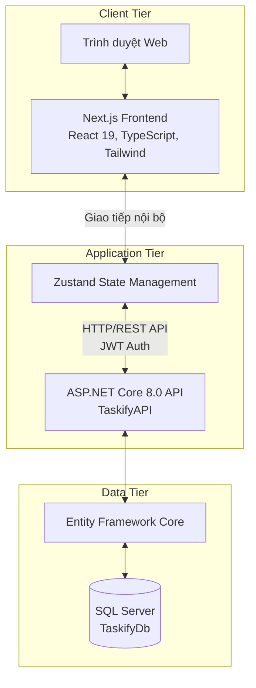

# Kiến trúc tổng quát của ứng dụng web

```mermaid
graph TD
    subgraph Client_Tier [Client Tier]
        Browser[Trình duyệt Web]
        NextJS[Next.js Frontend\nReact 19, TypeScript, Tailwind]
        Browser <--> NextJS
    end
    
    subgraph Application_Tier [Application Tier]
        Zustand[Zustand State Management]
        NextJS <-->|Giao tiếp nội bộ| Zustand
        TaskifyAPI[ASP.NET Core 8.0 API\nTaskifyAPI]
    end
    
    Zustand <-->|HTTP/REST API\nJWT Auth| TaskifyAPI
    
    subgraph Data_Tier [Data Tier]
        EF[Entity Framework Core]
        DB[(SQL Server\nTaskifyDb)]
    end
    
    TaskifyAPI <--> EF
    EF <--> DB
```
