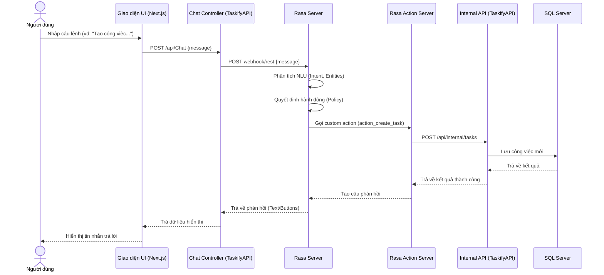

# Luồng xử lý yêu cầu ngôn ngữ tự nhiên trong hệ thống

```mermaid
sequenceDiagram
    actor User as Người dùng
    participant Frontend as Giao diện UI (Next.js)
    participant ChatAPI as Chat Controller (TaskifyAPI)
    participant Rasa as Rasa Server
    participant ActionServer as Rasa Action Server
    participant InternalAPI as Internal API (TaskifyAPI)
    participant DB as SQL Server
    
    User->>Frontend: Nhập câu lệnh (vd: "Tạo công việc...")
    Frontend->>ChatAPI: POST /api/Chat {message}
    ChatAPI->>Rasa: POST webhook/rest {message}
    Rasa->>Rasa: Phân tích NLU (Intent, Entities)
    Rasa->>Rasa: Quyết định hành động (Policy)
    Rasa->>ActionServer: Gọi custom action (action_create_task)
    ActionServer->>InternalAPI: POST /api/internal/tasks
    InternalAPI->>DB: Lưu công việc mới
    DB-->>InternalAPI: Trả về kết quả
    InternalAPI-->>ActionServer: Trả về kết quả thành công
    ActionServer-->>Rasa: Tạo câu phản hồi
    Rasa-->>ChatAPI: Trả về phản hồi (Text/Buttons)
    ChatAPI-->>Frontend: Trả dữ liệu hiển thị
    Frontend-->>User: Hiển thị tin nhắn trả lời
```
