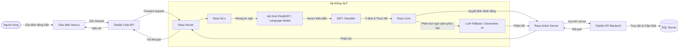

# Mô hình kết hợp Rasa, PhoBERT/LLM và Backend trong xử lý tiếng Việt

```mermaid
graph LR
    User([Người dùng]) -- Câu lệnh tiếng Việt --> Frontend[Giao diện Next.js]
    Frontend -- Gửi request --> API_Chat[Taskify Chat API]
    API_Chat -- Forward request --> Rasa[Rasa Server]
    
    subgraph Rasa_System [Hệ thống NLP]
        Rasa --> NLU[Rasa NLU]
        NLU -- Nhúng từ ngữ --> PhoBERT[Mô hình PhoBERT / Language Model]
        PhoBERT -- Vector biểu diễn --> DIET[DIET Classifier]
        DIET -- Ý định & Thực thể --> Core[Rasa Core]
        Core -- Phân tích ngữ cảnh phức tạp --> LLM[LLM Fallback / Generative AI]
    end
    
    Core -- Quyết định hành động --> Action[Rasa Action Server]
    LLM -- Phản hồi --> Action
    Action -- Gọi API nội bộ --> Backend[Taskify API Backend]
    Backend -- Truy vấn & Cập nhật --> DB[(SQL Server)]
    Backend -- Kết quả --> Action
    Action -- Phản hồi --> Rasa
    Rasa -- Trả kết quả --> API_Chat
    API_Chat -- Hiển thị --> Frontend
```
