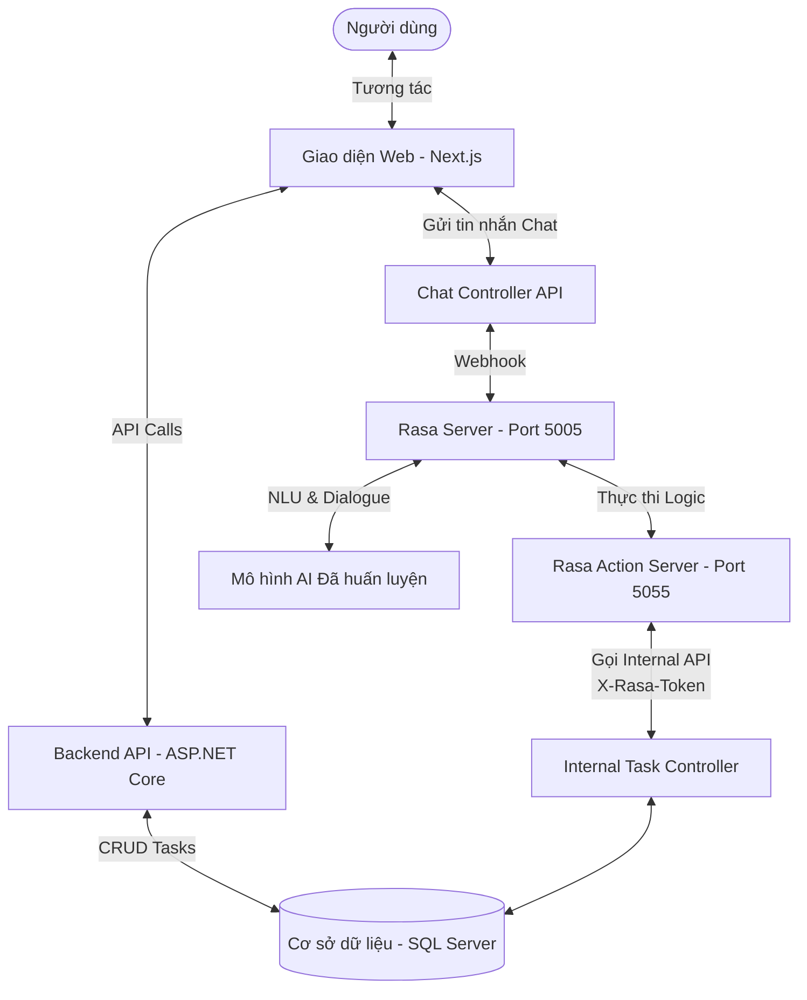

# Mô hình tổng thể hệ thống trợ lý ảo quản lý công việc cá nhân

```mermaid
graph TD
    Client([Người dùng]) <-->|Tương tác| UI[Giao diện Web - Next.js]
    UI <-->|API Calls| API_Gateway[Backend API - ASP.NET Core]
    
    API_Gateway <-->|CRUD Tasks| DB[(Cơ sở dữ liệu - SQL Server)]
    
    UI <-->|Gửi tin nhắn Chat| Chat_Service[Chat Controller API]
    Chat_Service <-->|Webhook| Rasa_Core[Rasa Server - Port 5005]
    
    Rasa_Core <-->|NLU & Dialogue| Rasa_Models[Mô hình AI Đã huấn luyện]
    Rasa_Core <-->|Thực thi Logic| Action_Server[Rasa Action Server - Port 5055]
    
    Action_Server <-->|Gọi Internal API\nX-Rasa-Token| Internal_API[Internal Task Controller]
    Internal_API <--> DB
```
