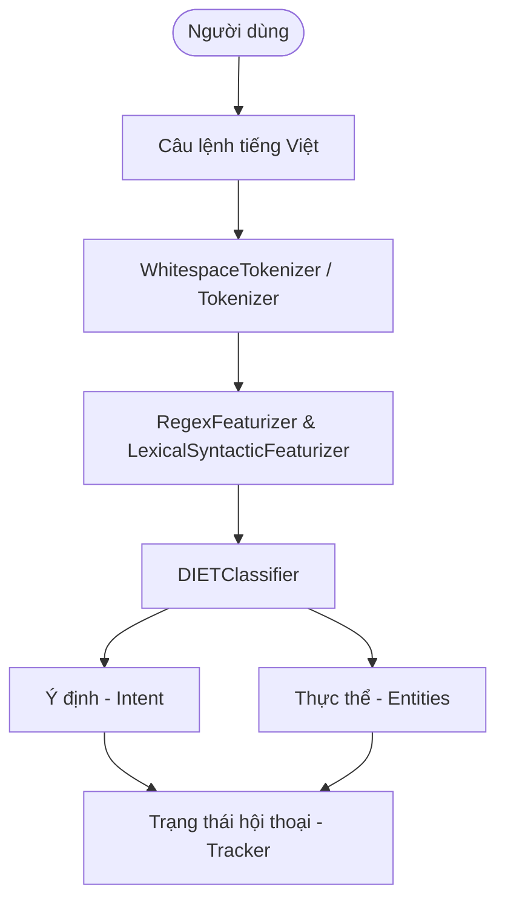

# Mô hình xử lý câu lệnh người dùng bằng Rasa NLU

```mermaid
graph TD
    User([Người dùng]) --> Input[Câu lệnh tiếng Việt]
    Input --> Tokenizer[WhitespaceTokenizer / Tokenizer]
    Tokenizer --> Featurizer[RegexFeaturizer & LexicalSyntacticFeaturizer]
    Featurizer --> Classifier[DIETClassifier]
    Classifier --> Intent[Ý định - Intent]
    Classifier --> Entities[Thực thể - Entities]
    Intent --> Tracker[Trạng thái hội thoại - Tracker]
    Entities --> Tracker
```
