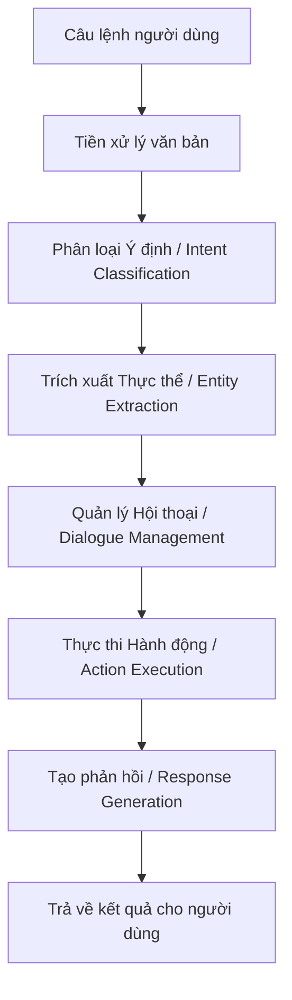

# Quy trình xử lý ngôn ngữ tự nhiên trong trợ lý ảo

```mermaid
graph TD
    A[Câu lệnh người dùng] --> B[Tiền xử lý văn bản]
    B --> C[Phân loại Ý định / Intent Classification]
    C --> D[Trích xuất Thực thể / Entity Extraction]
    D --> E[Quản lý Hội thoại / Dialogue Management]
    E --> F[Thực thi Hành động / Action Execution]
    F --> G[Tạo phản hồi / Response Generation]
    G --> H[Trả về kết quả cho người dùng]
```
