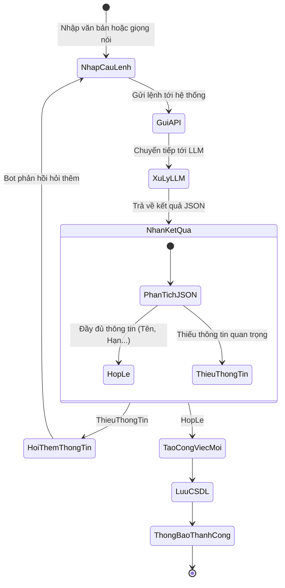

## 2.8.6. Biểu đồ hoạt động: Tạo công việc bằng trợ lý ảo

```mermaid
stateDiagram-v2
    [*] --> NhapCauLenh: Nhập văn bản hoặc giọng nói
    NhapCauLenh --> GuiAPI: Gửi lệnh tới hệ thống
    GuiAPI --> XuLyLLM: Chuyển tiếp tới LLM
    XuLyLLM --> NhanKetQua: Trả về kết quả JSON
    
    state NhanKetQua {
        [*] --> PhanTichJSON
        PhanTichJSON --> HopLe: Đầy đủ thông tin (Tên, Hạn...)
        PhanTichJSON --> ThieuThongTin: Thiếu thông tin quan trọng
    }
    
    NhanKetQua --> HoiThemThongTin: ThieuThongTin
    HoiThemThongTin --> NhapCauLenh: Bot phản hồi hỏi thêm
    
    NhanKetQua --> TaoCongViecMoi: HopLe
    TaoCongViecMoi --> LuuCSDL
    LuuCSDL --> ThongBaoThanhCong
    ThongBaoThanhCong --> [*]
```