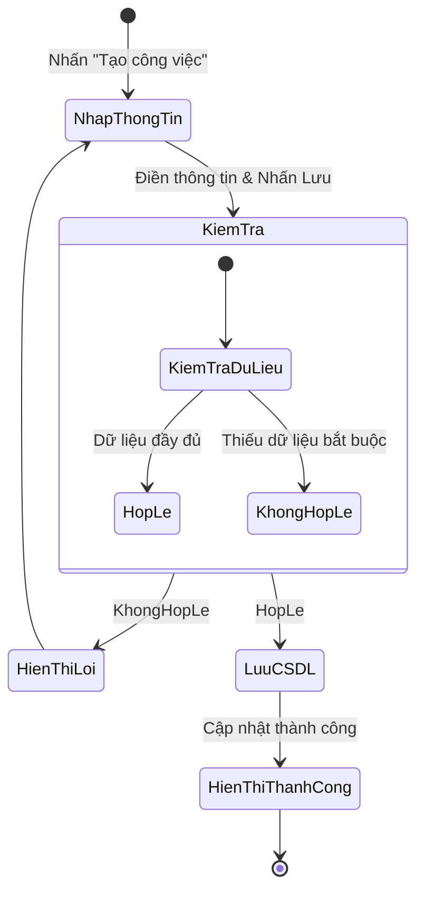

## 2.8.5. Biểu đồ hoạt động: Tạo công việc thủ công

```mermaid
stateDiagram-v2
    [*] --> NhapThongTin: Nhấn "Tạo công việc"
    NhapThongTin --> KiemTra: Điền thông tin & Nhấn Lưu
    
    state KiemTra {
        [*] --> KiemTraDuLieu
        KiemTraDuLieu --> HopLe: Dữ liệu đầy đủ
        KiemTraDuLieu --> KhongHopLe: Thiếu dữ liệu bắt buộc
    }
    
    KiemTra --> HienThiLoi: KhongHopLe
    HienThiLoi --> NhapThongTin
    
    KiemTra --> LuuCSDL: HopLe
    LuuCSDL --> HienThiThanhCong: Cập nhật thành công
    HienThiThanhCong --> [*]
```
