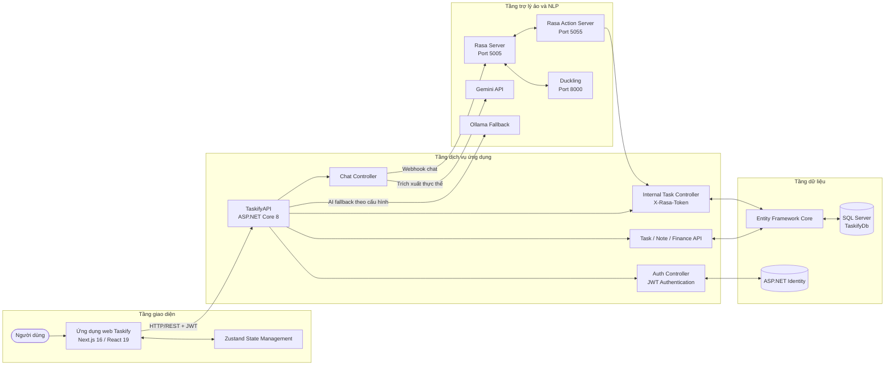

## 2.8.12. Biểu đồ kiến trúc hệ thống

Sơ đồ trên mô tả kiến trúc hệ thống Taskify theo các tầng chính: giao diện người dùng, dịch vụ backend, dữ liệu và khối trợ lý ảo. Kiến trúc này cho phép hệ thống vừa hỗ trợ các chức năng quản lý công việc truyền thống, vừa tích hợp xử lý ngôn ngữ tự nhiên để tạo và cập nhật công việc bằng hội thoại.
