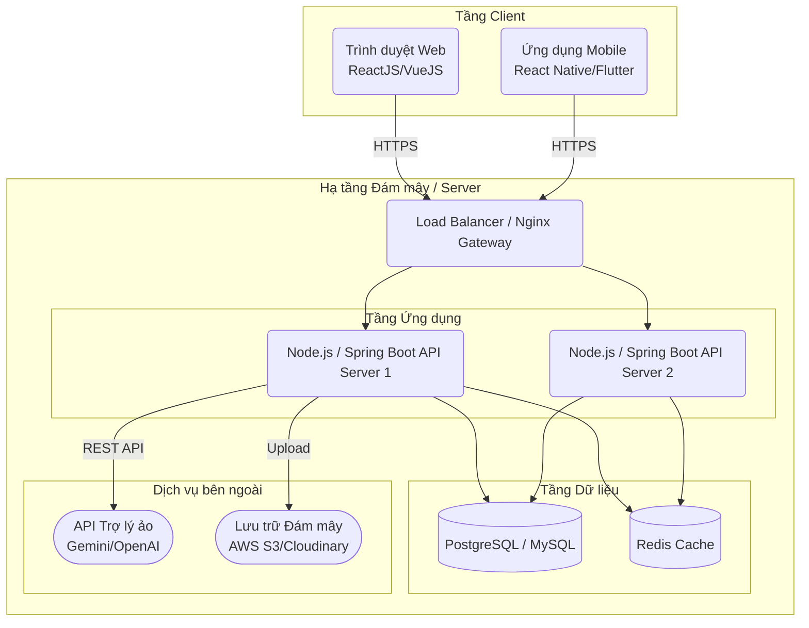

## 2.8.10. Biểu đồ kiến trúc triển khai

```mermaid
flowchart TD
    subgraph Client [Tầng Client]
        Browser(Trình duyệt Web\nReactJS/VueJS)
        Mobile(Ứng dụng Mobile\nReact Native/Flutter)
    end
    
    subgraph Cloud [Hạ tầng Đám mây / Server]
        LB(Load Balancer / Nginx Gateway)
        
        subgraph AppServers [Tầng Ứng dụng]
            API1(Node.js / Spring Boot API Server 1)
            API2(Node.js / Spring Boot API Server 2)
        end
        
        subgraph DataTier [Tầng Dữ liệu]
            DB[(PostgreSQL / MySQL)]
            Redis[(Redis Cache)]
        end
        
        subgraph External [Dịch vụ bên ngoài]
            LLM([API Trợ lý ảo\nGemini/OpenAI])
            S3([Lưu trữ Đám mây\nAWS S3/Cloudinary])
        end
    end
    
    Browser -->|HTTPS| LB
    Mobile -->|HTTPS| LB
    
    LB --> API1
    LB --> API2
    
    API1 --> DB
    API1 --> Redis
    API1 -->|REST API| LLM
    API1 -->|Upload| S3
    
    API2 --> DB
    API2 --> Redis
```
