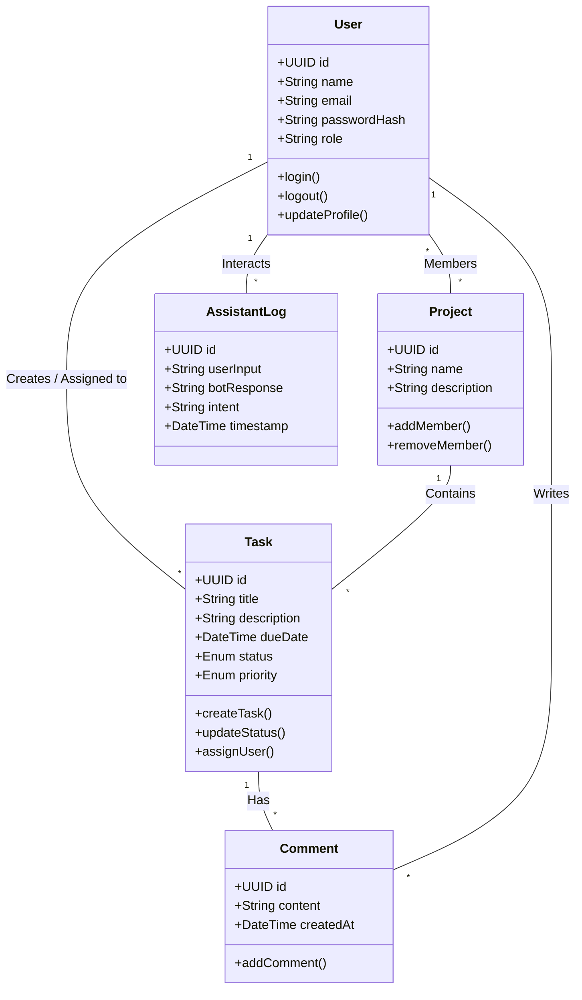

## 2.8.9. Biểu đồ lớp phân tích

```mermaid
classDiagram
    class User {
        +UUID id
        +String name
        +String email
        +String passwordHash
        +String role
        +login()
        +logout()
        +updateProfile()
    }
    
    class Task {
        +UUID id
        +String title
        +String description
        +DateTime dueDate
        +Enum status
        +Enum priority
        +createTask()
        +updateStatus()
        +assignUser()
    }
    
    class Project {
        +UUID id
        +String name
        +String description
        +addMember()
        +removeMember()
    }
    
    class Comment {
        +UUID id
        +String content
        +DateTime createdAt
        +addComment()
    }
    
    class AssistantLog {
        +UUID id
        +String userInput
        +String botResponse
        +String intent
        +DateTime timestamp
    }
    
    User "1" -- "*" Task : Creates / Assigned to
    Project "1" -- "*" Task : Contains
    User "*" -- "*" Project : Members
    Task "1" -- "*" Comment : Has
    User "1" -- "*" Comment : Writes
    User "1" -- "*" AssistantLog : Interacts
```
