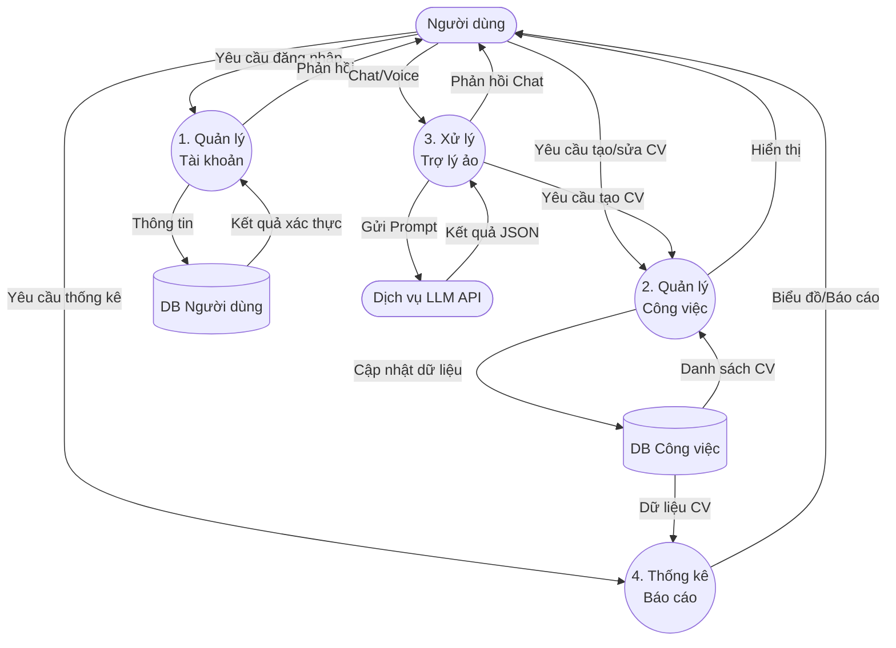

## 2.8.4. Biểu đồ luồng dữ liệu mức 1

```mermaid
flowchart TD
    User([Người dùng])
    
    P1((1. Quản lý\nTài khoản))
    P2((2. Quản lý\nCông việc))
    P3((3. Xử lý\nTrợ lý ảo))
    P4((4. Thống kê\nBáo cáo))
    
    DB1[(DB Người dùng)]
    DB2[(DB Công việc)]
    
    Bot([Dịch vụ LLM API])
    
    User -- Yêu cầu đăng nhập --> P1
    P1 -- Thông tin --> DB1
    DB1 -- Kết quả xác thực --> P1
    P1 -- Phản hồi --> User
    
    User -- Yêu cầu tạo/sửa CV --> P2
    P2 -- Cập nhật dữ liệu --> DB2
    DB2 -- Danh sách CV --> P2
    P2 -- Hiển thị --> User
    
    User -- Chat/Voice --> P3
    P3 -- Gửi Prompt --> Bot
    Bot -- Kết quả JSON --> P3
    P3 -- Yêu cầu tạo CV --> P2
    P3 -- Phản hồi Chat --> User
    
    User -- Yêu cầu thống kê --> P4
    DB2 -- Dữ liệu CV --> P4
    P4 -- Biểu đồ/Báo cáo --> User
```
