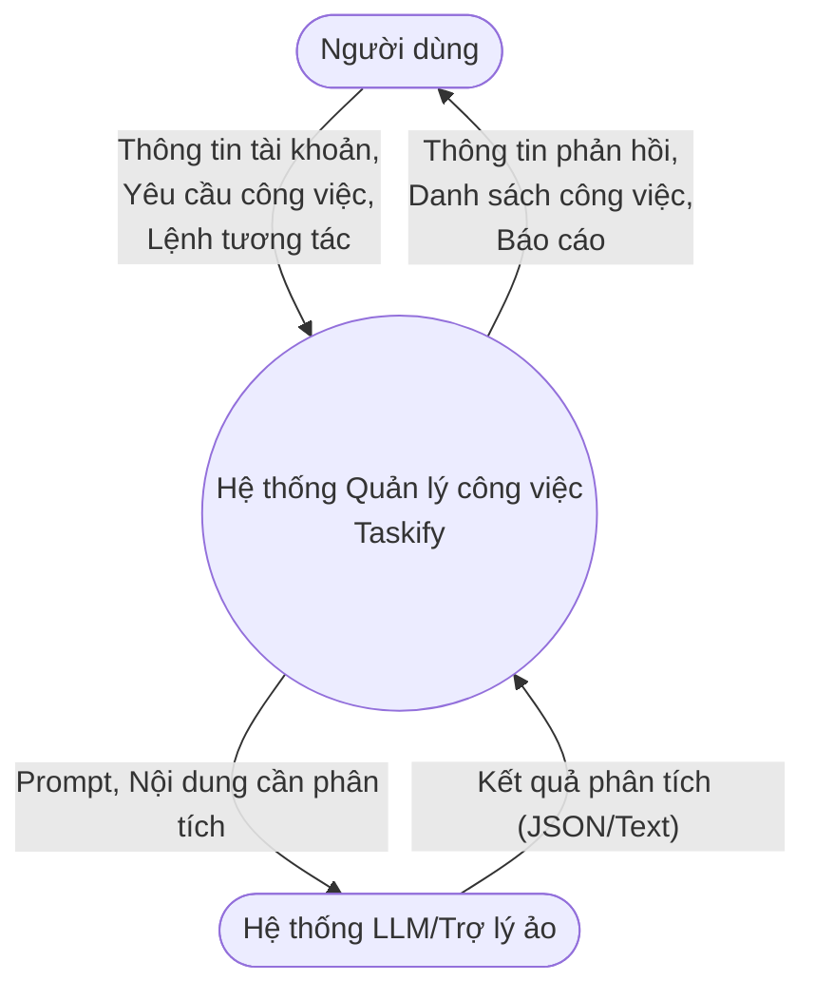

## 2.8.3. Biểu đồ luồng dữ liệu mức ngữ cảnh

```mermaid
flowchart TD
    User([Người dùng])
    Bot([Hệ thống LLM/Trợ lý ảo])
    System((Hệ thống Quản lý công việc\nTaskify))
    
    User -- "Thông tin tài khoản, \nYêu cầu công việc, \nLệnh tương tác" --> System
    System -- "Thông tin phản hồi, \nDanh sách công việc, \nBáo cáo" --> User
    
    System -- "Prompt, Nội dung cần phân tích" --> Bot
    Bot -- "Kết quả phân tích (JSON/Text)" --> System
```
