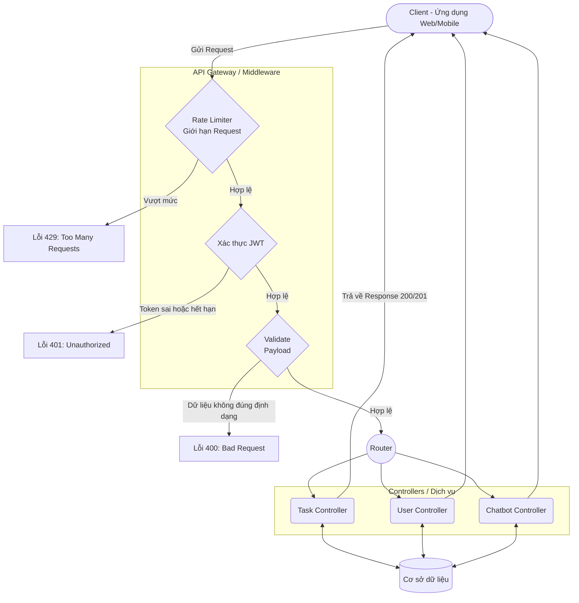

## 2.8.11. Biểu đồ luồng xử lý API tổng quát

```mermaid
flowchart TD
    Client([Client - Ứng dụng Web/Mobile])
    
    subgraph API_Gateway [API Gateway / Middleware]
        Auth{Xác thực JWT}
        RateLimit{Rate Limiter\nGiới hạn Request}
        Validate{Validate\nPayload}
    end
    
    subgraph Controllers [Controllers / Dịch vụ]
        TaskCtrl(Task Controller)
        UserCtrl(User Controller)
        ChatCtrl(Chatbot Controller)
    end
    
    DB[(Cơ sở dữ liệu)]
    
    Client -->|Gửi Request| RateLimit
    RateLimit -->|Vượt mức| 429[Lỗi 429: Too Many Requests]
    RateLimit -->|Hợp lệ| Auth
    
    Auth -->|Token sai hoặc hết hạn| 401[Lỗi 401: Unauthorized]
    Auth -->|Hợp lệ| Validate
    
    Validate -->|Dữ liệu không đúng định dạng| 400[Lỗi 400: Bad Request]
    Validate -->|Hợp lệ| Router((Router))
    
    Router --> TaskCtrl
    Router --> UserCtrl
    Router --> ChatCtrl
    
    TaskCtrl <--> DB
    UserCtrl <--> DB
    ChatCtrl <--> DB
    
    TaskCtrl -->|Trả về Response 200/201| Client
    UserCtrl --> Client
    ChatCtrl --> Client
```
