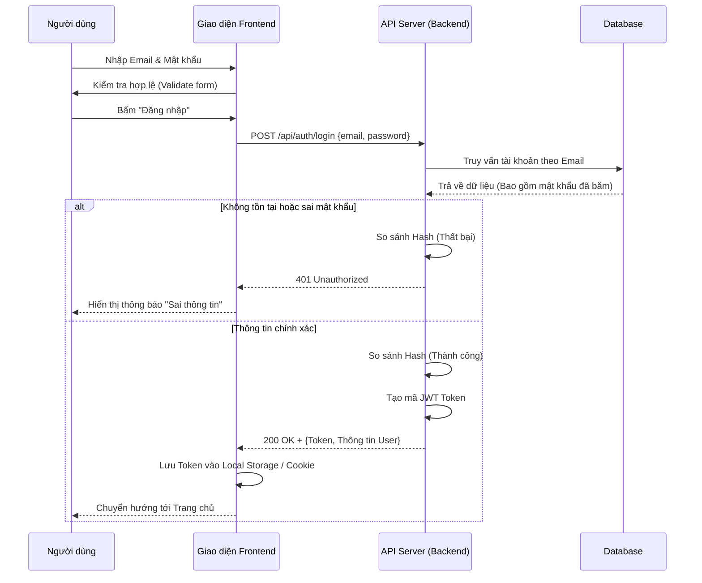

## 2.8.7. Biểu đồ tuần tự: Đăng nhập

```mermaid
sequenceDiagram
    participant U as Người dùng
    participant UI as Giao diện Frontend
    participant API as API Server (Backend)
    participant DB as Database
    
    U->>UI: Nhập Email & Mật khẩu
    UI->>U: Kiểm tra hợp lệ (Validate form)
    U->>UI: Bấm "Đăng nhập"
    UI->>API: POST /api/auth/login {email, password}
    API->>DB: Truy vấn tài khoản theo Email
    DB-->>API: Trả về dữ liệu (Bao gồm mật khẩu đã băm)
    
    alt Không tồn tại hoặc sai mật khẩu
        API->>API: So sánh Hash (Thất bại)
        API-->>UI: 401 Unauthorized
        UI-->>U: Hiển thị thông báo "Sai thông tin"
    else Thông tin chính xác
        API->>API: So sánh Hash (Thành công)
        API->>API: Tạo mã JWT Token
        API-->>UI: 200 OK + {Token, Thông tin User}
        UI->>UI: Lưu Token vào Local Storage / Cookie
        UI-->>U: Chuyển hướng tới Trang chủ
    end
```
