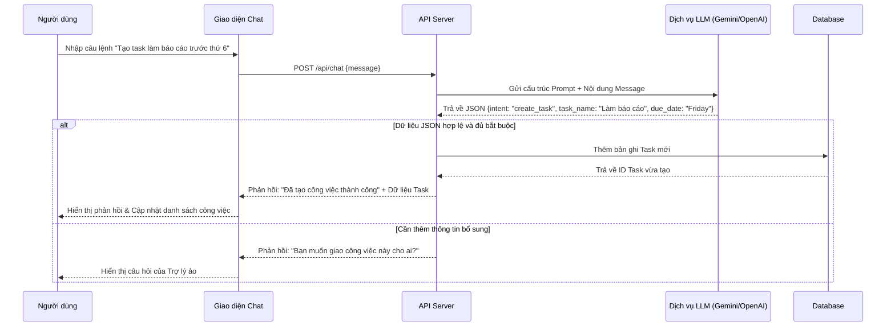

## 2.8.8. Biểu đồ tuần tự: Tạo công việc bằng trợ lý ảo

```mermaid
sequenceDiagram
    participant U as Người dùng
    participant UI as Giao diện Chat
    participant API as API Server
    participant LLM as Dịch vụ LLM (Gemini/OpenAI)
    participant DB as Database
    
    U->>UI: Nhập câu lệnh "Tạo task làm báo cáo trước thứ 6"
    UI->>API: POST /api/chat {message}
    API->>LLM: Gửi cấu trúc Prompt + Nội dung Message
    LLM-->>API: Trả về JSON {intent: "create_task", task_name: "Làm báo cáo", due_date: "Friday"}
    
    alt Dữ liệu JSON hợp lệ và đủ bắt buộc
        API->>DB: Thêm bản ghi Task mới
        DB-->>API: Trả về ID Task vừa tạo
        API-->>UI: Phản hồi: "Đã tạo công việc thành công" + Dữ liệu Task
        UI-->>U: Hiển thị phản hồi & Cập nhật danh sách công việc
    else Cần thêm thông tin bổ sung
        API-->>UI: Phản hồi: "Bạn muốn giao công việc này cho ai?"
        UI-->>U: Hiển thị câu hỏi của Trợ lý ảo
    end
```
