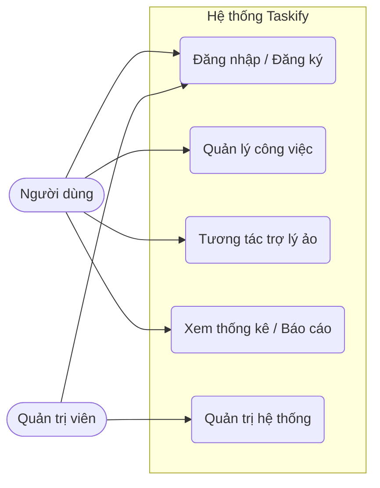

## 2.8.2. Biểu đồ Use Case tổng quát

```mermaid
flowchart LR
    User([Người dùng])
    Admin([Quản trị viên])
    
    subgraph Hệ_thống_Taskify [Hệ thống Taskify]
        UC1(Đăng nhập / Đăng ký)
        UC2(Quản lý công việc)
        UC3(Tương tác trợ lý ảo)
        UC4(Xem thống kê / Báo cáo)
        UC5(Quản trị hệ thống)
    end
    
    User --> UC1
    User --> UC2
    User --> UC3
    User --> UC4
    
    Admin --> UC1
    Admin --> UC5
```
