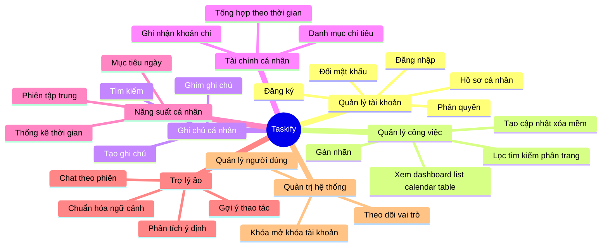
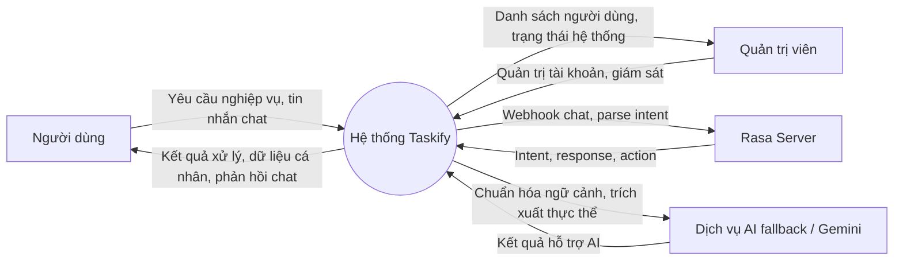
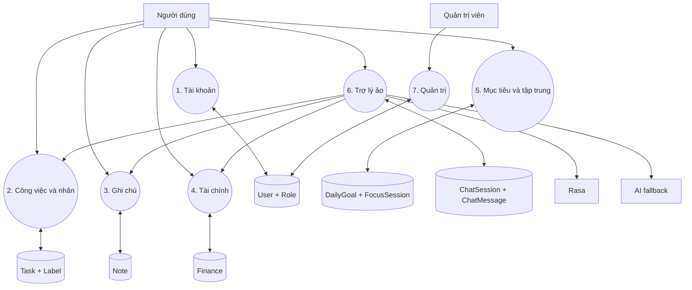

# 2.1. Phân tích hệ thống

## 2.1.1. Bài toán đặt ra

Trong thực tế, người dùng thường phải sử dụng nhiều công cụ rời rạc để quản lý công việc, ghi chú, theo dõi chi tiêu và duy trì tập trung. Điều này làm dữ liệu phân tán, khó tổng hợp và làm giảm hiệu quả cá nhân. Đề tài hướng tới xây dựng một hệ thống thống nhất, trong đó trợ lý ảo đóng vai trò cầu nối giữa người dùng và các chức năng nghiệp vụ.

`Taskify` giải quyết bài toán đó bằng cách cung cấp một nền tảng web tích hợp:

- quản lý công việc theo nhiều góc nhìn;
- lưu trữ ghi chú cá nhân;
- theo dõi chi tiêu theo danh mục;
- quản lý mục tiêu hằng ngày và phiên tập trung;
- trò chuyện với trợ lý ảo để thao tác nhanh trên dữ liệu cá nhân.

## 2.1.2. Mục tiêu phân tích

- Xác định rõ các chức năng cốt lõi của hệ thống.
- Xác định ranh giới giữa người dùng, hệ thống nghiệp vụ và dịch vụ AI.
- Làm rõ luồng dữ liệu giữa frontend, backend, cơ sở dữ liệu và Rasa/AI fallback.
- Làm cơ sở cho bước thiết kế kiến trúc, CSDL và API.

## 2.1.3. Nhóm chức năng chính

## 2.1.4. Yêu cầu chức năng

### a. Quản lý tài khoản

- Người dùng đăng ký, đăng nhập và xác thực bằng JWT.
- Người dùng cập nhật hồ sơ, ảnh đại diện, đổi mật khẩu.
- Quản trị viên quản lý người dùng, vai trò và trạng thái khóa tài khoản.

### b. Quản lý công việc

- Tạo, xem, cập nhật, xóa mềm công việc.
- Gán mức ưu tiên, trạng thái, hạn hoàn thành và nhãn.
- Tìm kiếm, lọc theo trạng thái, ưu tiên, nhãn, khoảng thời gian.
- Hiển thị theo dashboard, list, calendar và table.

### c. Ghi chú và tài chính

- Tạo và quản lý ghi chú cá nhân có ghim.
- Tạo danh mục chi tiêu và các khoản chi.
- Xem tổng hợp chi tiêu theo ngày, khoảng thời gian và danh mục.

### d. Năng suất cá nhân

- Tạo mục tiêu trong ngày.
- Bắt đầu và kết thúc phiên tập trung.
- Tổng hợp thống kê số phiên và thời lượng tập trung.

### e. Trợ lý ảo

- Duy trì phiên hội thoại.
- Phân tích ý định từ câu lệnh tự nhiên.
- Kết nối tới Rasa và fallback AI khi cần.
- Trả về phản hồi hội thoại và có thể kích hoạt hành động nội bộ.

## 2.1.5. Yêu cầu phi chức năng

- Giao diện web phản hồi tốt trên desktop và mobile.
- API tách biệt rõ với giao diện người dùng.
- Dữ liệu cá nhân được phân tách theo người dùng.
- Hệ thống dễ mở rộng thêm kỹ năng AI và phân hệ mới.
- Bảo mật ở mức xác thực, phân quyền, kiểm soát API nội bộ và lưu vết hội thoại.

## 2.1.6. Biểu đồ ngữ cảnh

## 2.1.7. Biểu đồ luồng dữ liệu mức 1

## 2.1.8. Nhận xét

Phân tích cho thấy `Taskify` là một hệ thống đa phân hệ nhưng vẫn xoay quanh một lõi dữ liệu người dùng chung. Trợ lý ảo không thay thế lớp nghiệp vụ mà đóng vai trò lớp tương tác thông minh, giúp khai thác dữ liệu cá nhân nhanh hơn. Cách tổ chức này phù hợp với định hướng phát triển một trợ lý ảo hỗ trợ công việc cá nhân có khả năng mở rộng trong tương lai.
