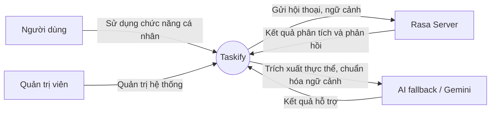
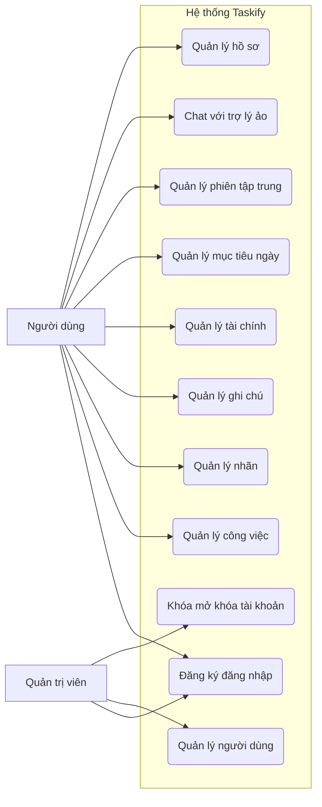

# 2.2. Phân tích tác nhân

## 2.2.1. Danh sách tác nhân

| Tác nhân | Loại | Vai trò chính |
|---|---|---|
| Người dùng | Trực tiếp | Sử dụng hệ thống để quản lý công việc, ghi chú, chi tiêu, mục tiêu ngày, phiên tập trung và trò chuyện với trợ lý ảo |
| Quản trị viên | Trực tiếp | Quản lý tài khoản, vai trò, khóa hoặc mở khóa người dùng, giám sát vận hành |
| Rasa Server | Gián tiếp | Phân tích ý định, điều phối hội thoại, gọi hành động nghiệp vụ từ luồng chat |
| AI fallback / Gemini | Gián tiếp | Chuẩn hóa ngữ cảnh và hỗ trợ trích xuất thực thể khi hội thoại cần xử lý linh hoạt hơn |

## 2.2.2. Mục tiêu của từng tác nhân

### a. Người dùng

- Quản lý công việc cá nhân trên một nền tảng tập trung.
- Ghi lại thông tin ngắn hạn bằng ghi chú.
- Theo dõi chi tiêu cá nhân.
- Duy trì năng suất bằng mục tiêu ngày và phiên tập trung.
- Tương tác tự nhiên với trợ lý ảo để giảm thao tác thủ công.

### b. Quản trị viên

- Kiểm soát an toàn hệ thống.
- Duy trì vai trò `Admin` và `User`.
- Xử lý các tài khoản vi phạm hoặc cần hỗ trợ.

### c. Tác nhân AI

- Tiếp nhận và phân tích nội dung hội thoại.
- Chuyển câu lệnh ngôn ngữ tự nhiên thành đầu vào có cấu trúc.
- Hỗ trợ phản hồi và gợi ý thao tác tiếp theo.

## 2.2.3. Biểu đồ quan hệ tác nhân với hệ thống

## 2.2.4. Biểu đồ use case tổng quát theo tác nhân

## 2.2.5. Ma trận tác nhân - chức năng

| Chức năng | Người dùng | Quản trị viên | Rasa | AI fallback |
|---|---|---|---|---|
| Đăng nhập, hồ sơ | x | x |  |  |
| Quản lý công việc | x | x | hỗ trợ qua chat | hỗ trợ ngữ cảnh |
| Quản lý ghi chú | x |  | có thể mở rộng | hỗ trợ ngữ cảnh |
| Quản lý tài chính | x |  | có thể mở rộng | hỗ trợ ngữ cảnh |
| Mục tiêu ngày, tập trung | x |  |  |  |
| Quản lý hội thoại | x |  | x | x |
| Quản trị người dùng |  | x |  |  |

## 2.2.6. Nhận xét

Tác nhân trung tâm của hệ thống là **người dùng cá nhân**, vì hầu hết dữ liệu và chức năng đều được thiết kế theo phạm vi sở hữu riêng. **Quản trị viên** có phạm vi hẹp hơn nhưng quan trọng ở khía cạnh an toàn vận hành. Các tác nhân AI mang tính hỗ trợ, giúp tăng tính thông minh cho giao diện tương tác mà không làm thay đổi quy tắc nghiệp vụ cốt lõi.
