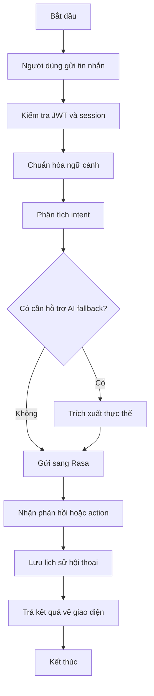
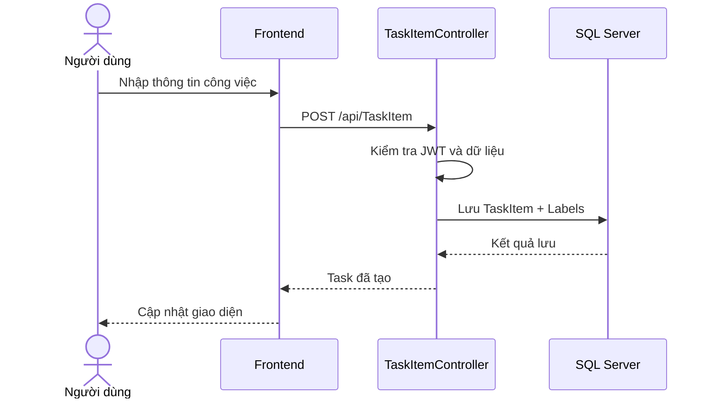

# 2.3. Đặc tả use case

## 2.3.1. Use case chính

| Mã | Tên use case | Tác nhân chính | Mục tiêu |
|---|---|---|---|
| UC-01 | Đăng nhập hệ thống | Người dùng | Truy cập các chức năng cá nhân |
| UC-02 | Quản lý công việc | Người dùng | Tạo, cập nhật, theo dõi tiến độ công việc |
| UC-03 | Gán nhãn và lọc công việc | Người dùng | Tổ chức dữ liệu công việc khoa học hơn |
| UC-04 | Quản lý ghi chú | Người dùng | Lưu nội dung cá nhân nhanh chóng |
| UC-05 | Quản lý chi tiêu | Người dùng | Ghi nhận và thống kê khoản chi |
| UC-06 | Quản lý mục tiêu ngày | Người dùng | Theo dõi mục tiêu ngắn hạn |
| UC-07 | Quản lý phiên tập trung | Người dùng | Rèn luyện thói quen làm việc tập trung |
| UC-08 | Trò chuyện với trợ lý ảo | Người dùng | Tương tác ngôn ngữ tự nhiên với hệ thống |
| UC-09 | Quản lý người dùng | Quản trị viên | Quản lý tài khoản và vai trò |

## 2.3.2. Đặc tả use case UC-02: Quản lý công việc

- Tác nhân: Người dùng
- Tiền điều kiện: Người dùng đã đăng nhập hợp lệ.
- Hậu điều kiện: Dữ liệu công việc được tạo mới hoặc cập nhật vào hệ thống.

### Luồng chính

1. Người dùng mở phân hệ công việc.
2. Hệ thống hiển thị danh sách công việc theo quyền truy cập.
3. Người dùng chọn tạo mới hoặc chỉnh sửa công việc.
4. Người dùng nhập tiêu đề, mô tả, mức ưu tiên, trạng thái, hạn hoàn thành và nhãn.
5. Hệ thống kiểm tra dữ liệu.
6. Hệ thống lưu dữ liệu và trả về kết quả cập nhật.

### Luồng thay thế

- Nếu dữ liệu không hợp lệ, hệ thống trả về lỗi kiểm tra.
- Nếu người dùng không có quyền trên công việc, hệ thống từ chối thao tác.

## 2.3.3. Đặc tả use case UC-08: Trò chuyện với trợ lý ảo

- Tác nhân: Người dùng
- Tác nhân phụ: Rasa Server, AI fallback
- Tiền điều kiện: Người dùng đã đăng nhập.
- Hậu điều kiện: Hội thoại được lưu; hệ thống trả về phản hồi tương ứng.

### Luồng chính

1. Người dùng mở màn hình chat AI.
2. Người dùng gửi tin nhắn.
3. Backend chuẩn hóa ngữ cảnh hội thoại.
4. Hệ thống gọi Rasa để phân tích ý định.
5. Nếu cần, hệ thống gọi AI fallback để hỗ trợ trích xuất thực thể.
6. Rasa hoặc action nội bộ trả về phản hồi.
7. Hệ thống lưu tin nhắn người dùng và phản hồi trợ lý.
8. Giao diện hiển thị kết quả cho người dùng.

## 2.3.4. Biểu đồ hoạt động cho use case chat AI

## 2.3.5. Biểu đồ tuần tự cho quản lý công việc

