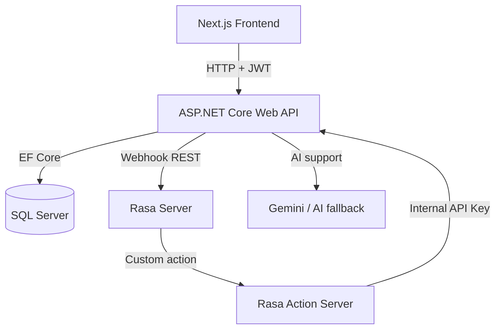
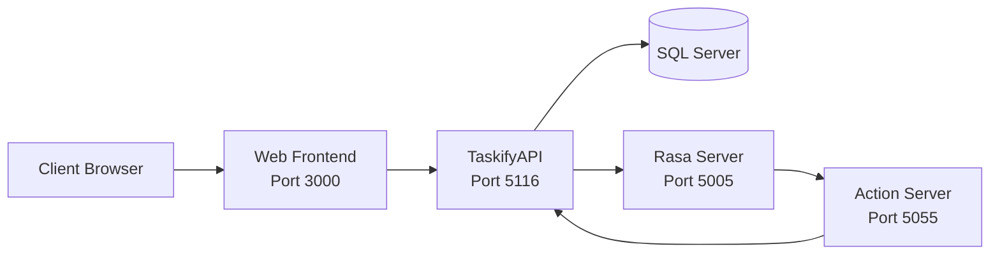

# 2.4. Thiết kế tổng thể

## 2.4.1. Quan điểm thiết kế

Hệ thống được thiết kế theo kiến trúc tách lớp giữa giao diện, API nghiệp vụ, cơ sở dữ liệu và dịch vụ trợ lý ảo. Cách tổ chức này giúp:

- dễ phát triển song song frontend và backend;
- thuận lợi bảo trì, kiểm thử và mở rộng;
- giữ cho lớp AI độc lập tương đối với nghiệp vụ cốt lõi.

## 2.4.2. Kiến trúc tổng thể

## 2.4.3. Thiết kế phân lớp

| Lớp | Công nghệ | Vai trò |
|---|---|---|
| Trình bày | Next.js, React, TypeScript | Giao diện người dùng, điều hướng, hiển thị dữ liệu |
| Quản lý trạng thái | Zustand | Đồng bộ trạng thái đăng nhập, dữ liệu nghiệp vụ và UI |
| API nghiệp vụ | ASP.NET Core 8 | Xử lý xác thực, phân quyền, nghiệp vụ và tích hợp ngoài |
| Truy cập dữ liệu | EF Core, Repository, Unit of Work | Thao tác cơ sở dữ liệu có kiểm soát |
| Dữ liệu | SQL Server | Lưu người dùng, công việc, chat, ghi chú, tài chính, thống kê cá nhân |
| AI hội thoại | Rasa, action server, AI fallback | Xử lý hội thoại, intent, action và hỗ trợ ngữ cảnh |

## 2.4.4. Thành phần chính của hệ thống

### Frontend

- trang đăng nhập, đăng ký;
- dashboard chính;
- các màn hình `tasks`, `notes`, `finance`, `focus`, `ai`, `settings`, `admin/users`;
- các thành phần bảng, thẻ công việc, biểu đồ hoàn thành.

### Backend

- `AuthController` cho xác thực và hồ sơ;
- `TaskItemController`, `LabelController`;
- `NotesController`;
- `FinanceEntriesController`, `FinanceCategoriesController`;
- `DailyGoalController`, `FocusSessionController`;
- `ChatController`;
- `AdminUsersController`.

### AI

- `Rasa Server` xử lý intent và dialogue;
- `Rasa Action Server` gọi action tùy biến;
- `InternalTaskController`, `InternalNoteController`, `InternalFinanceController` hỗ trợ thao tác nội bộ;
- `AI fallback` hỗ trợ chuẩn hóa ngữ cảnh và trích xuất thực thể.

## 2.4.5. Biểu đồ triển khai

## 2.4.6. Luồng xử lý tiêu biểu

### a. Luồng CRUD công việc

Người dùng thao tác trên frontend, yêu cầu được gửi đến `TaskItemController`, backend kiểm tra JWT và quyền truy cập, sau đó lưu dữ liệu bằng EF Core vào SQL Server rồi trả kết quả lại giao diện.

### b. Luồng chat trợ lý ảo

Người dùng gửi tin nhắn, frontend gọi `ChatController`, backend chuẩn hóa ngữ cảnh và xác định phiên chat, sau đó chuyển nội dung sang Rasa. Nếu hội thoại yêu cầu thao tác nghiệp vụ, action server có thể gọi API nội bộ đã được bảo vệ bằng API key để đọc hoặc cập nhật dữ liệu liên quan.

## 2.4.7. Nhận xét

Kiến trúc tổng thể của `Taskify` phù hợp với bài toán trợ lý ảo hỗ trợ công việc cá nhân vì dữ liệu nghiệp vụ được kiểm soát tập trung ở backend, còn AI được tổ chức thành lớp tích hợp độc lập, giúp dễ mở rộng và hạn chế rủi ro ảnh hưởng trực tiếp đến dữ liệu chính.
