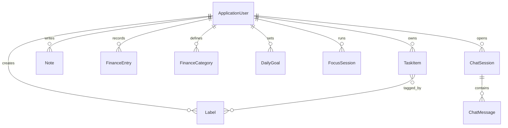

# 2.5. Thiết kế cơ sở dữ liệu

## 2.5.1. Mục tiêu thiết kế

Cơ sở dữ liệu được thiết kế theo hướng:

- tách dữ liệu theo từng người dùng;
- hỗ trợ nhiều phân hệ dùng chung một tài khoản;
- thuận lợi cho truy vấn thống kê và mở rộng;
- đảm bảo toàn vẹn giữa dữ liệu nghiệp vụ và lịch sử hội thoại.

## 2.5.2. Các thực thể chính

| Thực thể | Ý nghĩa |
|---|---|
| `ApplicationUser` | Tài khoản người dùng và quản trị viên |
| `TaskItem` | Công việc cá nhân |
| `Label` | Nhãn gắn với công việc |
| `Note` | Ghi chú cá nhân |
| `FinanceEntry` | Khoản chi tiêu cá nhân |
| `FinanceCategory` | Danh mục chi tiêu |
| `DailyGoal` | Mục tiêu trong ngày |
| `FocusSession` | Phiên làm việc tập trung |
| `ChatSession` | Phiên hội thoại với trợ lý ảo |
| `ChatMessage` | Tin nhắn thuộc một phiên chat |

## 2.5.3. Mô hình ERD khái quát

## 2.5.4. Thiết kế bảng dữ liệu trọng tâm

### a. Bảng người dùng

| Trường | Kiểu | Ghi chú |
|---|---|---|
| `Id` | string | Khóa chính |
| `Email` | string | Đăng nhập |
| `UserName` | string | Tên hiển thị |
| `AvatarUrl` | string, null | Ảnh đại diện |

### b. Bảng công việc `TaskItem`

| Trường | Kiểu | Ghi chú |
|---|---|---|
| `Id` | int | Khóa chính |
| `Title` | string(200) | Tiêu đề |
| `Description` | string(4000) | Mô tả |
| `Priority` | enum | Low, Medium, High |
| `Status` | enum | Todo, InProgress, Completed |
| `DueDate` | datetime | Hạn hoàn thành |
| `CreatedAt` | datetime | Thời điểm tạo |
| `IsDeleted` | bool | Xóa mềm |
| `DeletedAt` | datetime, null | Thời điểm xóa |
| `UserId` | string | Khóa ngoại tới người dùng |

### c. Bảng nhãn `Label`

| Trường | Kiểu | Ghi chú |
|---|---|---|
| `Id` | int | Khóa chính |
| `Name` | string(60) | Tên nhãn |
| `Color` | string(20) | Màu hiển thị |
| `UserId` | string | Chủ sở hữu |
| `CreatedAt` | datetime | Thời điểm tạo |

### d. Bảng ghi chú `Note`

| Trường | Kiểu | Ghi chú |
|---|---|---|
| `Id` | int | Khóa chính |
| `Title` | string(200) | Tiêu đề |
| `Content` | string(4000) | Nội dung |
| `IsPinned` | bool | Ghim ghi chú |
| `CreatedAt` | datetime | Tạo mới |
| `UpdatedAt` | datetime | Cập nhật gần nhất |
| `UserId` | string | Chủ sở hữu |

### e. Bảng tài chính `FinanceEntry`

| Trường | Kiểu | Ghi chú |
|---|---|---|
| `Id` | int | Khóa chính |
| `Date` | datetime | Ngày ghi nhận |
| `Category` | string(60) | Danh mục |
| `Description` | string(500) | Mô tả |
| `Amount` | decimal(18,2) | Số tiền |
| `CreatedAt` | datetime | Tạo mới |
| `UpdatedAt` | datetime | Cập nhật |
| `UserId` | string | Chủ sở hữu |

### f. Bảng năng suất cá nhân

`DailyGoal` lưu mục tiêu theo ngày, còn `FocusSession` lưu thời lượng, số lần nghỉ và trạng thái hoàn thành phiên tập trung. Hai bảng này phục vụ thống kê năng suất ngắn hạn.

### g. Bảng hội thoại

`ChatSession` đại diện cho một cuộc trò chuyện, còn `ChatMessage` lưu từng tin nhắn theo vai trò `User` hoặc `Assistant`, kèm `MetadataJson` để lưu thông tin intent, ngữ cảnh hoặc dữ liệu hỗ trợ AI.

## 2.5.5. Biểu đồ quan hệ dữ liệu cho hội thoại AI

## 2.5.6. Nhận xét

Thiết kế CSDL của `Taskify` đảm bảo mỗi phân hệ có cấu trúc dữ liệu riêng nhưng vẫn liên kết thống nhất qua `ApplicationUser`. Điều này phù hợp với bài toán trợ lý ảo cá nhân, vì mọi truy vấn và phản hồi thông minh đều cần ngữ cảnh xuất phát từ dữ liệu của chính người dùng đó.
