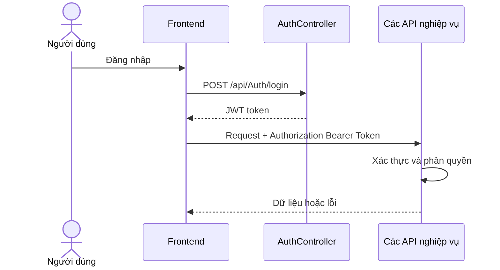
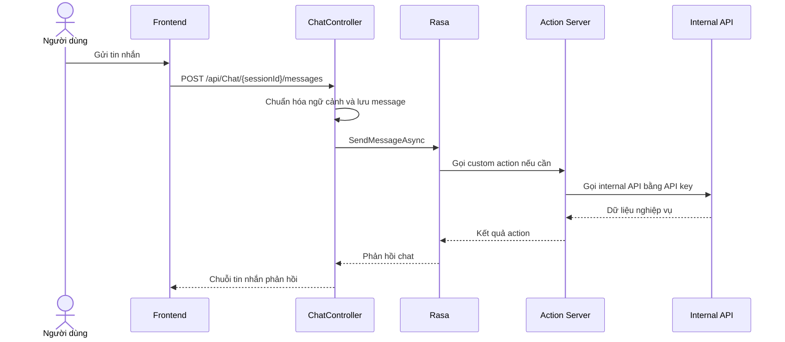

# 2.6. Thiết kế API

## 2.6.1. Nguyên tắc thiết kế

API của hệ thống được xây dựng theo phong cách RESTful, trả dữ liệu JSON và sử dụng JWT Bearer cho hầu hết các endpoint nghiệp vụ. Các API nội bộ dành cho action server được bảo vệ thêm bằng API key.

## 2.6.2. Nhóm API chính

| Nhóm API | Chức năng |
|---|---|
| `AuthController` | Đăng ký, đăng nhập, hồ sơ, đổi mật khẩu |
| `TaskItemController` | CRUD công việc, cập nhật trạng thái, hạn hoàn thành |
| `LabelController` | CRUD nhãn |
| `NotesController` | CRUD ghi chú |
| `FinanceEntriesController` | CRUD chi tiêu, thống kê |
| `FinanceCategoriesController` | Quản lý danh mục chi tiêu |
| `DailyGoalController` | Quản lý mục tiêu ngày |
| `FocusSessionController` | Bắt đầu, kết thúc, thống kê phiên tập trung |
| `ChatController` | Quản lý phiên chat và nhắn tin với trợ lý ảo |
| `AdminUsersController` | Quản trị người dùng |

## 2.6.3. Bảng endpoint tiêu biểu

| Method | Endpoint | Mô tả |
|---|---|---|
| `POST` | `/api/Auth/login` | Đăng nhập |
| `GET` | `/api/TaskItem` | Lấy danh sách công việc có lọc |
| `POST` | `/api/TaskItem` | Tạo công việc mới |
| `PATCH` | `/api/TaskItem/{id}/status` | Cập nhật trạng thái |
| `GET` | `/api/Notes` | Lấy danh sách ghi chú |
| `POST` | `/api/FinanceEntries` | Thêm khoản chi |
| `GET` | `/api/FinanceEntries/summary` | Lấy thống kê chi tiêu |
| `GET` | `/api/DailyGoal/today` | Lấy mục tiêu hôm nay |
| `POST` | `/api/FocusSession/start` | Bắt đầu phiên tập trung |
| `POST` | `/api/Chat/{sessionId}/messages` | Gửi tin nhắn cho trợ lý ảo |
| `GET` | `/api/AdminUsers` | Danh sách người dùng cho admin |

## 2.6.4. Luồng xác thực API

## 2.6.5. Luồng API chat trợ lý ảo

## 2.6.6. Chuẩn phản hồi và xử lý lỗi

- `200 OK`: lấy dữ liệu hoặc cập nhật thành công.
- `201 Created`: tạo mới thành công.
- `204 No Content`: xóa thành công.
- `400 Bad Request`: dữ liệu đầu vào không hợp lệ.
- `401 Unauthorized`: chưa đăng nhập hoặc token không hợp lệ.
- `403 Forbidden`: không đủ quyền.
- `404 Not Found`: không tìm thấy tài nguyên.
- `409 Conflict`: xung đột dữ liệu như tên nhãn đã tồn tại.

## 2.6.7. Nhận xét

Thiết kế API của `Taskify` thể hiện rõ sự tách biệt giữa các nhóm nghiệp vụ. Đặc biệt, luồng chat AI được tổ chức thành một lớp tích hợp riêng nhưng vẫn tuân thủ nguyên tắc kiểm soát truy cập như các API còn lại, giúp hệ thống vừa linh hoạt vừa an toàn.
