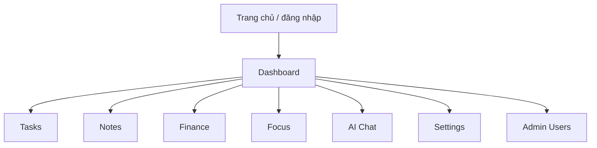
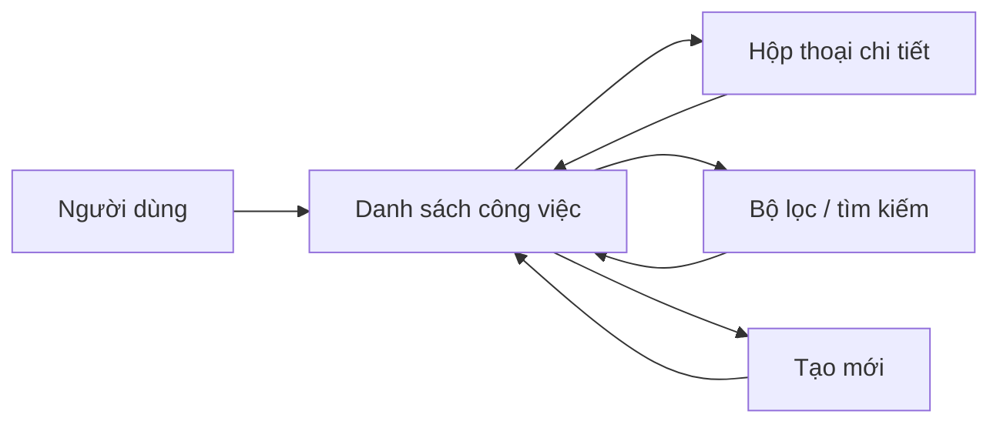

# 2.7. Thiết kế giao diện

## 2.7.1. Mục tiêu thiết kế giao diện

Giao diện hệ thống được thiết kế theo hướng:

- trực quan, dễ dùng với người quản lý công việc cá nhân;
- thống nhất giữa các phân hệ;
- thao tác nhanh trên cả desktop và thiết bị di động;
- ưu tiên trải nghiệm hội thoại tự nhiên với trợ lý ảo.

## 2.7.2. Cấu trúc điều hướng

## 2.7.3. Mô tả các màn hình chính

### a. Màn hình đăng nhập và đăng ký

- nhập email và mật khẩu;
- điều hướng sang đăng ký khi chưa có tài khoản;
- nhận phản hồi lỗi xác thực trực tiếp.

### b. Dashboard tổng quan

- hiển thị nhanh dữ liệu quan trọng;
- đóng vai trò điểm vào cho các phân hệ;
- hỗ trợ điều hướng bằng sidebar và top bar.

### c. Phân hệ công việc

- hỗ trợ nhiều chế độ xem: dashboard, list, calendar, table;
- cho phép mở hộp thoại tạo và chỉnh sửa task;
- hiển thị badge trạng thái, ưu tiên, nhãn;
- hỗ trợ tìm kiếm, lọc và thao tác nhanh.

### d. Phân hệ AI chat

- hiển thị danh sách phiên hội thoại;
- khung chat theo từng session;
- lưu lịch sử tin nhắn người dùng và trợ lý;
- hỗ trợ trải nghiệm hỏi đáp tự nhiên.

### e. Phân hệ ghi chú, tài chính, tập trung

- `Notes`: danh sách ghi chú, ghim và tìm kiếm;
- `Finance`: quản lý khoản chi và theo dõi tổng hợp;
- `Focus`: bắt đầu phiên tập trung, kết thúc phiên và xem thống kê;
- `Daily goals`: hỗ trợ mục tiêu ngắn hạn trong ngày.

### f. Màn hình quản trị

- chỉ hiển thị với vai trò `Admin`;
- quản lý danh sách người dùng;
- thay đổi vai trò, khóa hoặc mở khóa tài khoản.

## 2.7.4. Biểu đồ luồng thao tác giao diện công việc

## 2.7.5. Nguyên tắc UI/UX áp dụng

- phân hệ hóa rõ ràng theo nhu cầu cá nhân;
- giữ các thao tác CRUD ở số bước tối thiểu;
- dùng màu sắc và badge để phân biệt trạng thái, ưu tiên;
- đảm bảo các phản hồi như loading, lỗi, thành công hiển thị rõ ràng;
- giữ trải nghiệm chat tách biệt nhưng liên kết chặt với dữ liệu thật.

## 2.7.6. Nhận xét

Thiết kế giao diện của `Taskify` phù hợp với đối tượng người dùng cá nhân vì vừa hỗ trợ thao tác quản trị dữ liệu theo cách trực quan, vừa mở ra cách tương tác mới thông qua hội thoại AI. Đây là yếu tố quan trọng để đề tài thể hiện rõ tính ứng dụng của trợ lý ảo trong công việc hằng ngày.
