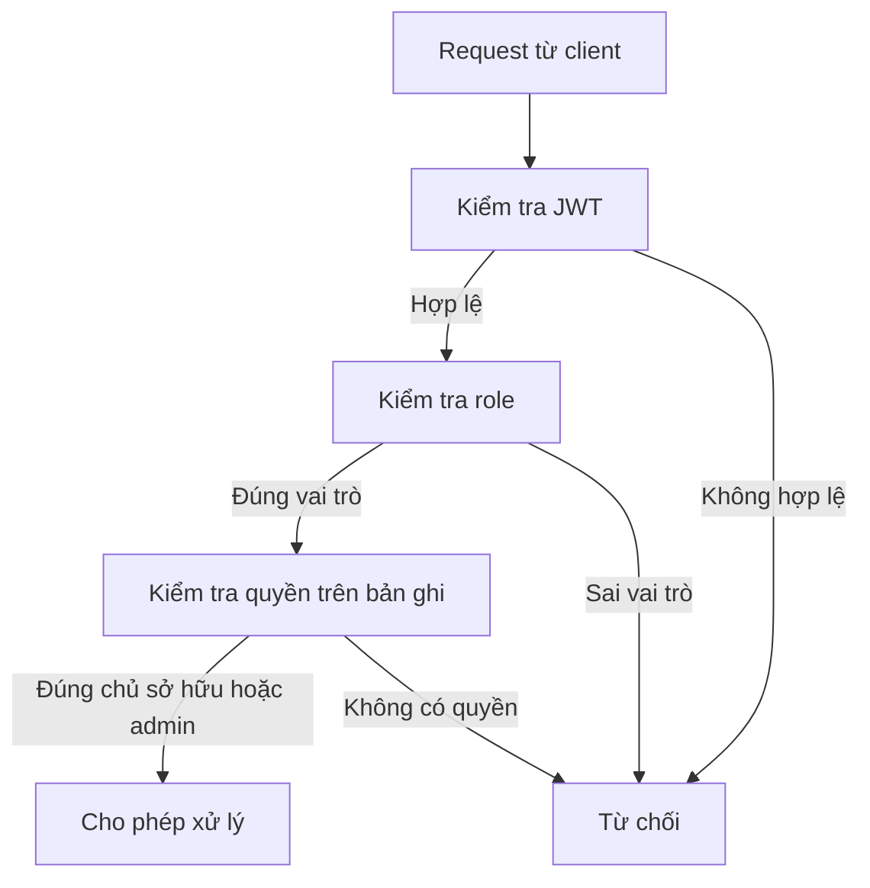

# 2.8. Thiết kế bảo mật

## 2.8.1. Mục tiêu bảo mật

Vì hệ thống xử lý dữ liệu cá nhân và hội thoại, bảo mật là yêu cầu bắt buộc. Thiết kế bảo mật hướng tới:

- xác thực đúng người dùng;
- phân quyền đúng phạm vi thao tác;
- bảo vệ API nội bộ khỏi truy cập trái phép;
- hạn chế rò rỉ dữ liệu giữa các người dùng;
- bảo vệ cấu hình nhạy cảm.

## 2.8.2. Xác thực người dùng

Hệ thống sử dụng **JWT Bearer Token**. Sau khi đăng nhập thành công, backend cấp token cho frontend. Các request tiếp theo gửi token qua header `Authorization: Bearer <token>`.

Lợi ích của cơ chế này:

- phù hợp với ứng dụng SPA hiện đại;
- dễ tích hợp cho nhiều nhóm API;
- hỗ trợ kiểm tra danh tính ở mọi request.

## 2.8.3. Phân quyền truy cập

Hệ thống hiện có hai vai trò:

- `User`: chỉ thao tác trên dữ liệu cá nhân;
- `Admin`: có thêm quyền quản trị người dùng.

Các controller nghiệp vụ đều kiểm tra `UserId` hiện tại trước khi đọc hoặc thay đổi dữ liệu. Điều này giúp tránh truy cập chéo giữa các tài khoản.

## 2.8.4. Bảo vệ API nội bộ

Các API nội bộ phục vụ Rasa action server không mở công khai như API thông thường. Chúng được bảo vệ bằng API key riêng, ví dụ header `X-Rasa-Token`, giúp:

- chỉ cho phép action server gọi;
- tách biệt luồng thao tác AI với luồng người dùng;
- giảm nguy cơ bị khai thác trực tiếp từ bên ngoài.

## 2.8.5. Kiểm soát dữ liệu nhạy cảm

- Mật khẩu được quản lý bởi ASP.NET Core Identity.
- Token JWT có thời hạn sống xác định.
- Các khóa cấu hình như `SecretKey`, API key AI cần đưa về biến môi trường khi triển khai thực tế.
- Hội thoại được lưu nhưng vẫn cần kiểm soát nội dung metadata và quyền truy cập theo chủ sở hữu.

## 2.8.6. Biểu đồ kiểm soát truy cập

## 2.8.7. Rủi ro và hướng tăng cường

- áp dụng HTTPS bắt buộc khi triển khai;
- cấu hình CORS chặt chẽ theo domain;
- ghi log truy cập và lỗi bảo mật;
- bổ sung rate limiting cho API chat;
- mã hóa hoặc ẩn bớt metadata nhạy cảm trong hội thoại nếu mở rộng quy mô.

## 2.8.8. Nhận xét

Giải pháp bảo mật của `Taskify` phù hợp với một hệ thống trợ lý ảo cá nhân trên nền web. Việc kết hợp JWT, phân quyền theo vai trò, kiểm tra quyền trên dữ liệu và tách API nội bộ là nền tảng quan trọng để đảm bảo an toàn cho dữ liệu người dùng.
