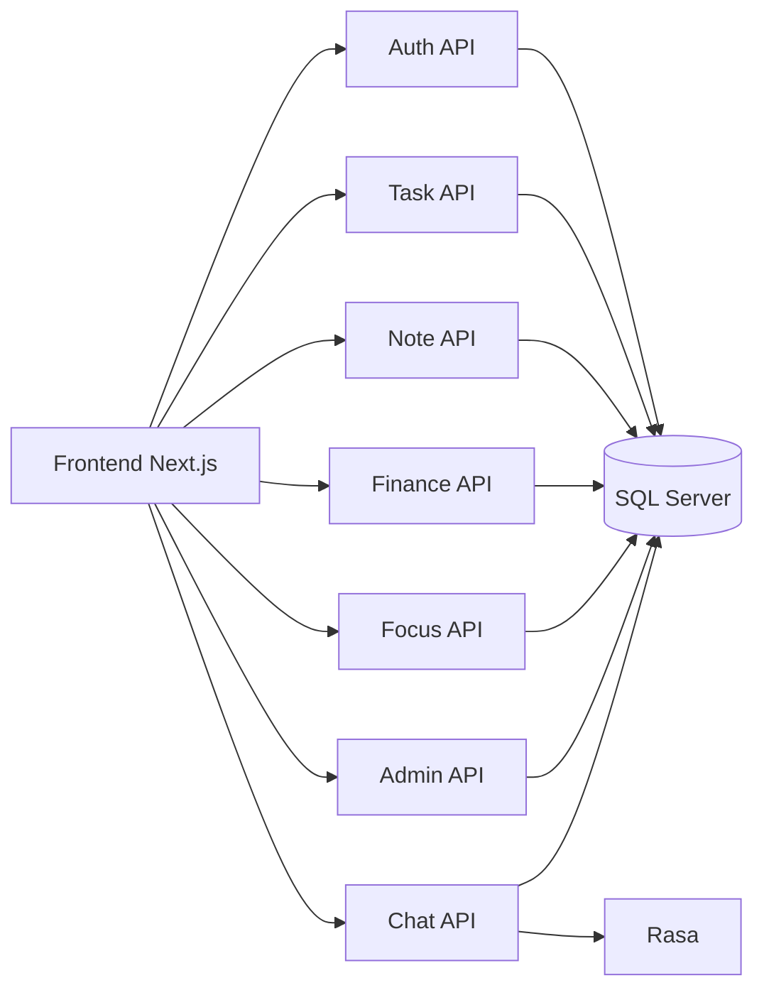
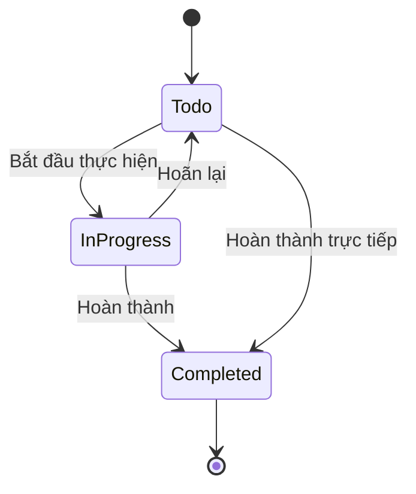
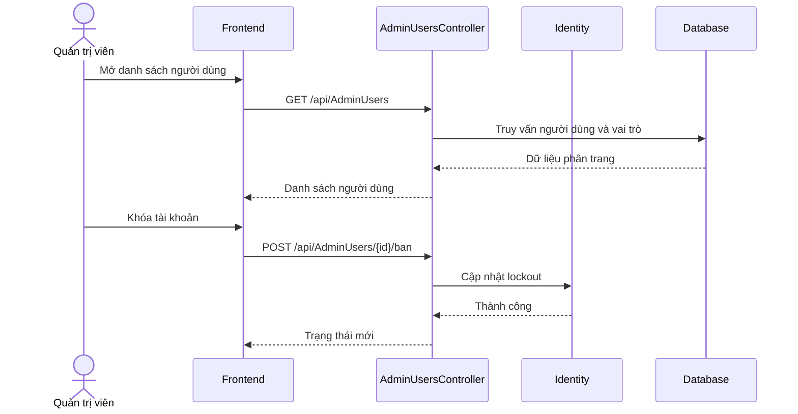
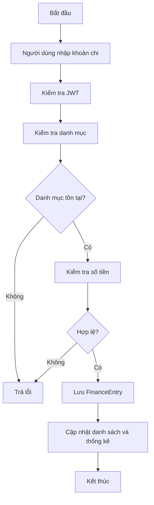

# 2.9. Hệ thống biểu đồ thiết kế

Mục này tổng hợp các biểu đồ quan trọng phục vụ việc mô tả hệ thống theo góc nhìn phân tích và thiết kế.

## 2.9.1. Biểu đồ thành phần

## 2.9.2. Biểu đồ trạng thái công việc

## 2.9.3. Biểu đồ tuần tự cho quản trị người dùng

## 2.9.4. Biểu đồ hoạt động quản lý chi tiêu

## 2.9.5. Ý nghĩa sử dụng biểu đồ

- Biểu đồ ngữ cảnh và DFD giúp mô tả ranh giới hệ thống.
- Biểu đồ use case và hoạt động giúp mô tả hành vi nghiệp vụ.
- Biểu đồ tuần tự giúp làm rõ thứ tự tương tác giữa các thành phần.
- Biểu đồ trạng thái giúp mô tả vòng đời đối tượng chính như `TaskItem`.
- Biểu đồ ERD và thành phần giúp hỗ trợ thiết kế triển khai thực tế.
