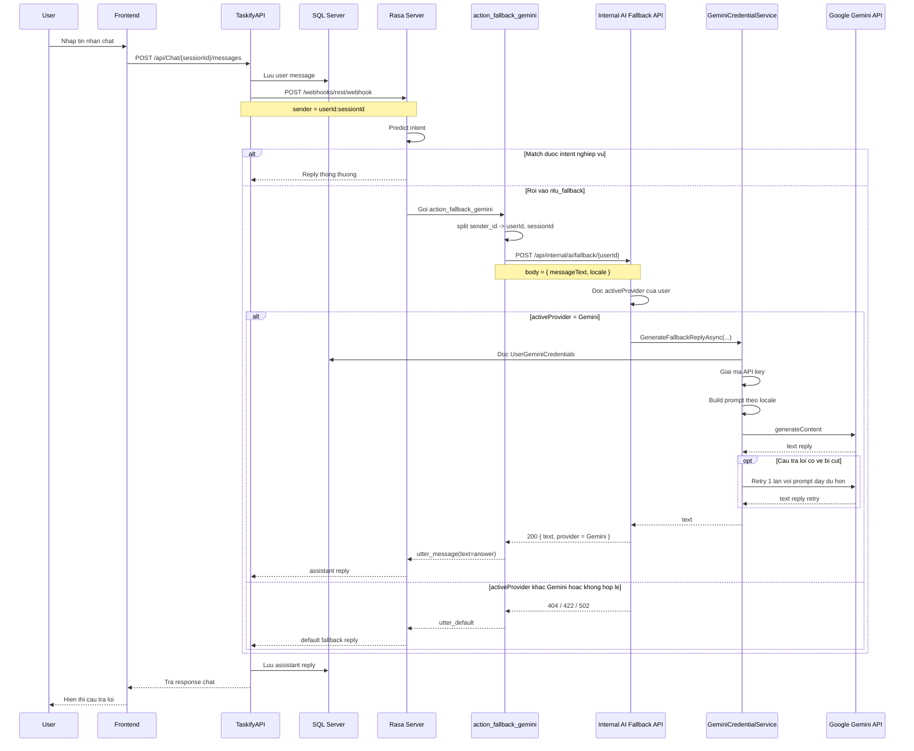
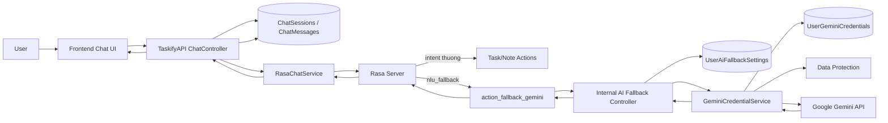

# Luong Chat Khi Fallback Sang Gemini

## Muc tieu

Tai lieu nay mo ta luong chat khi:

- user gui mot cau ma Rasa khong match duoc intent nghiep vu
- Rasa roi vao `nlu_fallback`
- backend dang co `activeProvider = Gemini`

Luu y:

- hien tai endpoint fallback la endpoint generic
- Rasa khong goi Gemini truc tiep nua
- backend tu quyet dinh se dung Gemini hay Ollama
- tai lieu nay chi mo ta nhanh `Gemini`

## Dieu kien de nhanh Gemini duoc su dung

Can dong thoi thoa 2 dieu kien:

1. User da luu Gemini API key hop le trong settings.
2. `activeProvider` cua user dang la `Gemini`.

Neu mot trong hai dieu kien nay khong dung, backend se khong di vao nhanh Gemini.

## So do sequence



## So do module interaction



## Giai thich tung khoi

- `Frontend Chat UI`
  - gui message len backend
  - nhan reply va hien thi cho user

- `ChatController`
  - lay `userId` tu JWT
  - tao `senderId = userId:sessionId`
  - luu lich su chat
  - proxy message sang Rasa

- `Rasa Server`
  - phan tich intent
  - neu confidence thap hoac khong match thi roi vao `nlu_fallback`

- `action_fallback_gemini`
  - ten action van giu nhu cu
  - nhung ben trong khong goi Gemini truc tiep
  - action nay chi goi endpoint fallback generic o backend

- `Internal AI Fallback Controller`
  - kiem tra `X-Rasa-Token`
  - doc `activeProvider` cua user
  - neu provider dang la `Gemini` thi goi `GeminiCredentialService`

- `GeminiCredentialService`
  - doc key theo user
  - giai ma key
  - build prompt fallback
  - goi Google Gemini API
  - retry neu cau tra loi co dau hieu bi cut

## Cac nhanh loi quan trong

### 1. User chua luu Gemini key

- backend khong tim thay credential hop le
- internal fallback tra `404`
- action tra `utter_default`

### 2. Key da luu nhung khong con hop le

- Gemini tra loi ve loi api key / quyen
- backend cap nhat status key thanh `Invalid`
- internal fallback tra `422`
- action tra `utter_default`

### 3. Key da luu nhung khong giai ma duoc

- Data Protection khong unprotect duoc key
- backend cap nhat status thanh `ValidationFailed`
- internal fallback tra `422`
- action tra `utter_default`

### 4. Gemini runtime loi

- timeout
- malformed JSON
- service tam thoi loi

Khi do:

- internal fallback tra `502`
- action tra `utter_default`

## Tom tat ngan gon

Nhanh Gemini hien tai la:

```text
Frontend
-> TaskifyAPI ChatController
-> Rasa REST webhook
-> action_fallback_gemini
-> TaskifyAPI /api/internal/ai/fallback/{userId}
-> check activeProvider = Gemini
-> GeminiCredentialService
-> UserGeminiCredentials
-> Google Gemini API
-> tra text nguoc ve Rasa
-> TaskifyAPI luu assistant message
-> Frontend hien thi
```

Neu co bat ky loi nao trong nhanh Gemini, chat se khong vo flow ma se roi ve `utter_default`.
