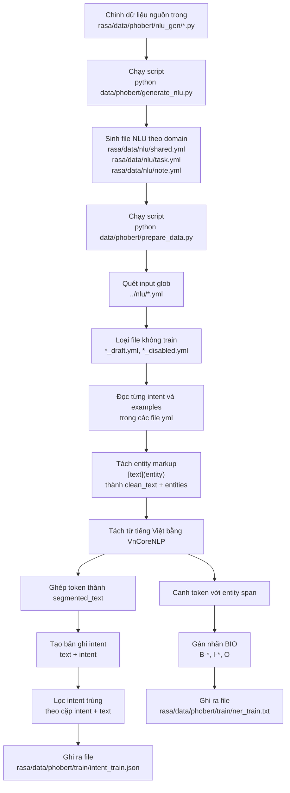

# Luồng tạo file `intent_train.json` và `ner_train.txt`

Tài liệu này mô tả riêng phần tạo dữ liệu train cho PhoBERT từ bộ NLU của Rasa.

## Sơ đồ luồng


.png)
## Diễn giải ngắn

1. `generate_nlu.py` sinh dữ liệu NLU Rasa theo từng domain vào `rasa/data/nlu/*.yml`.
2. `prepare_data.py` đọc các file YAML đó và bỏ qua các file có hậu tố như `*_draft.yml`, `*_disabled.yml`.
3. Mỗi câu example được tách phần entity từ cú pháp Rasa, ví dụ `[ngày mai](due_date)`.
4. Câu sạch được đưa qua VnCoreNLP để word segmentation.
5. Từ kết quả segmentation:
   - Sinh bản ghi `intent` gồm `text` đã segment và `intent`, sau đó lọc các dòng trùng theo cặp `intent + text` rồi mới ghi `intent_train.json`.
   - Sinh `ner_train.txt`: mỗi token được gán nhãn BIO theo entity tương ứng.

## Input và output chính

- Input generator:
  - `rasa/data/phobert/nlu_gen/shared.py`
  - `rasa/data/phobert/nlu_gen/task.py`
  - `rasa/data/phobert/nlu_gen/note.py`
- Input cho bước prepare:
  - `rasa/data/nlu/*.yml`
- Output:
  - `rasa/data/phobert/train/intent_train.json`
  - `rasa/data/phobert/train/ner_train.txt`

## Lệnh chạy

```bash
cd rasa
python data/phobert/generate_nlu.py
python data/phobert/prepare_data.py
```

## Ví dụ dữ liệu đi qua luồng

Example gốc trong NLU:

```text
tạo task [học tiếng anh](task_title) vào [ngày mai](due_date)
```

Sau khi bỏ markup entity:

```text
tạo task học tiếng anh vào ngày mai
```

Sau khi VnCoreNLP segmentation:

```text
tạo task học tiếng_anh vào ngày_mai
```

Ghi vào `intent_train.json`:

```json
{
  "text": "tạo task học tiếng_anh vào ngày_mai",
  "intent": "create_task"
}
```

Ghi vào `ner_train.txt`:

```text
tạo O
task O
học B-task_title
tiếng_anh I-task_title
vào O
ngày_mai B-due_date
```
