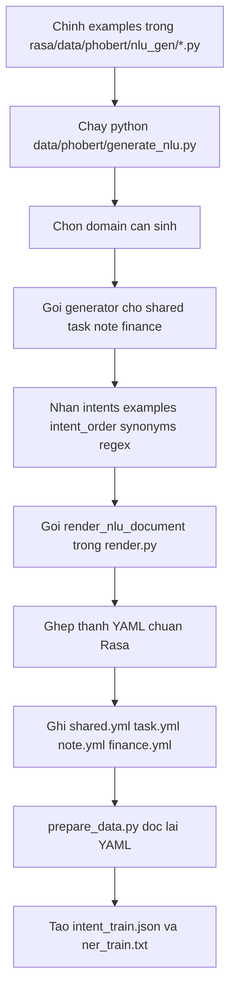
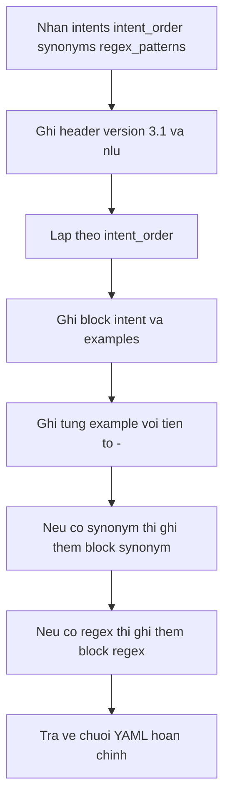
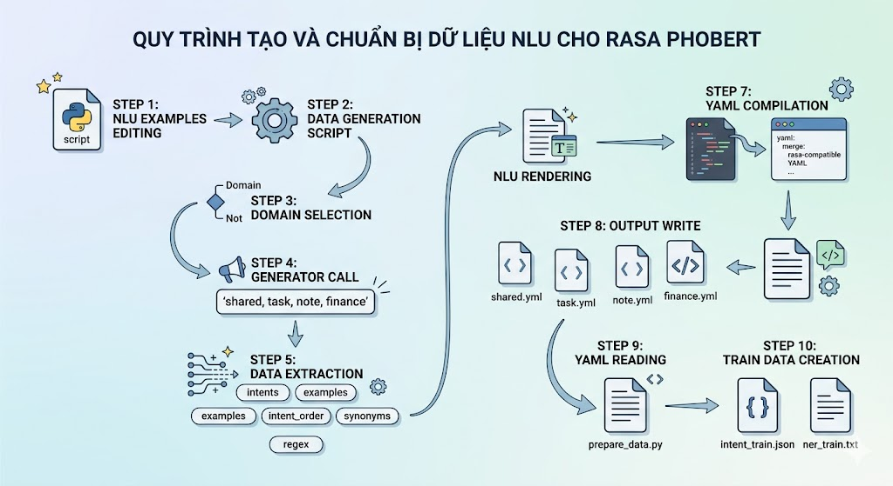
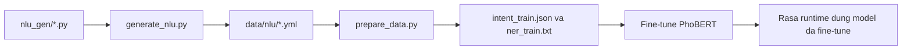

# Luồng `nlu_gen` trong Rasa

Tài liệu này giải thích riêng phần sinh dữ liệu NLU từ `rasa/data/phobert/nlu_gen/*` trước khi đưa sang bước `prepare_data.py` và huấn luyện PhoBERT.

## 1. Mục tiêu của `nlu_gen`

`nlu_gen` không dùng để train model trực tiếp.
Nó là lớp generator tạo ra các file NLU YAML chuẩn của Rasa trong `rasa/data/nlu/*.yml`.

Luồng tổng quát:



Ví dụ đi xuyên qua đúng luồng trên:

Nguồn trong `rasa/data/phobert/nlu_gen/task.py`:

```text
tạo công việc [viết báo cáo](task_title) [ngày mai](due_date) [14h](due_time)
```

Khi chạy `python data/phobert/generate_nlu.py`, domain `task` sẽ gọi `get_task_intents()`.

Dữ liệu trả về từ generator:

```python
{
    "create_task": [
        "tạo công việc [viết báo cáo](task_title) [ngày mai](due_date) [14h](due_time)"
    ]
}
```

`render_nlu_document()` sẽ biến nó thành YAML:

```yml
- intent: create_task
  examples: |
    - tạo công việc [viết báo cáo](task_title) [ngày mai](due_date) [14h](due_time)
```

`write_document()` ghi block đó vào `rasa/data/nlu/task.yml`.

Sau đó `prepare_data.py` mới đọc lại example này để tách entity và sinh dữ liệu train cho PhoBERT.

## 2. Entry point: `generate_nlu.py`

File: `rasa/data/phobert/generate_nlu.py`

Script này là đầu mối điều phối toàn bộ luồng `nlu_gen`.

Nó làm 5 việc chính:

1. Đọc tham số CLI:
   - `--domains`: danh sách domain cần sinh, mặc định là `task,note,shared,finance`
   - `--out`: thư mục output, mặc định là `rasa/data/nlu`

2. Khai báo bảng ánh xạ domain -> generator:
   - `shared` -> `get_shared_intents`, `SHARED_INTENT_ORDER`, `SHARED_SYNONYMS`, `SHARED_REGEX`
   - `task` -> `get_task_intents`, `TASK_INTENT_ORDER`
   - `note` -> `get_note_intents`, `NOTE_INTENT_ORDER`
   - `finance` -> `get_finance_intents`, `FINANCE_INTENT_ORDER`, `FINANCE_REGEX`

3. Validate domain đầu vào:
   - Nếu domain không nằm trong bảng hỗ trợ thì script dừng với `ValueError`

4. Gọi generator của từng domain:
   - Mỗi generator trả về `Dict[str, List[str]]`
   - Key là tên intent
   - Value là danh sách câu examples đã gắn entity theo cú pháp Rasa nếu cần

5. Render và ghi file:
   - `render_nlu_document(...)` biến dữ liệu Python thành YAML text
   - `write_document(...)` ghi ra file `<domain>.yml`

## 3. Vai trò từng module trong `nlu_gen`

### `shared.py`

File này chứa dữ liệu dùng chung cho bot:

- Intent chung:
  - `greet`
  - `goodbye`
  - `affirm`
  - `deny`
  - `ask_howcanhelp`
  - `nlu_fallback`

- Synonym chung:
  - chuẩn hóa các cách nói về `priority` như `khẩn cấp`, `quan trọng`, `cao`

- Regex chung:
  - `due_time`
  - `due_date`

Điểm quan trọng:

- `SHARED_INTENT_ORDER` quyết định intent nào sẽ xuất hiện trước trong file YAML
- `SHARED_SYNONYMS` và `SHARED_REGEX` chỉ có ở domain này trong luồng hiện tại
- `nlu_fallback` được khai báo như một intent thật để giữ các ví dụ nhiễu hoặc mơ hồ

### `task.py`

File này sinh examples cho các intent liên quan đến task:

- `summarize_week`
- `help_prioritize`
- `filter_tasks`
- `create_task`
- `delete_task`
- `confirm_delete_selection`
- `undo_delete_task`

Đặc điểm của `task.py`:

- Có nhiều hàm con như `create_task_examples()`, `delete_task_examples()`, `filter_task_examples()`
- Dùng entity annotation trực tiếp trong example, ví dụ:
  - `[viết báo cáo](task_title)`
  - `[ngày mai](due_date)`
  - `[14h](due_time)`
  - `[cao](priority)`
- Dùng `expand(...)` để nhân thêm biến thể câu nói tự nhiên
- Dùng `uniq(...)` để loại trùng

### `note.py`

File này sinh examples cho các intent ghi chú:

- `create_note`
- `list_notes`
- `search_notes`
- `pin_note`
- `update_note`
- `delete_note`

Đặc điểm:

- Dữ liệu gọn hơn `task.py`
- Chủ yếu dùng các entity:
  - `note_title`
  - `note_text`
  - `note_keyword`

### `finance.py`

File này sinh examples cho domain tài chính:

- `create_finance_entry`
- `list_finance_entries`
- `search_finance_entries`
- `update_finance_entry`
- `delete_finance_entry`
- `summarize_finance`
- `create_finance_category`
- `list_finance_categories`
- `update_finance_category`
- `delete_finance_category`

Ngoài intent examples, file này còn có:

- `FINANCE_REGEX` cho:
  - `finance_amount`
  - `finance_date`

Khác với `task.py` và `note.py`, domain `finance` đang khai báo data khá trực tiếp, ít dùng `expand(...)` hơn.

### `utils.py`

Đây là helper nhỏ nhưng rất quan trọng:

- `uniq(items)`:
  - chuẩn hóa chữ thường
  - bỏ chuỗi rỗng
  - loại câu trùng

- `expand(base, target)`:
  - lấy bộ câu gốc
  - thêm hậu tố như `giúp mình`, `nha`, `ngay`, `với`
  - tăng số lượng example đến ngưỡng mục tiêu

Ý nghĩa:

- Giúp tăng độ phủ dữ liệu mà không phải viết tay toàn bộ câu
- Giữ output ổn định và dễ kiểm soát hơn so với sinh ngẫu nhiên

## 4. Bước render YAML trong `render.py`

File: `rasa/data/phobert/nlu_gen/render.py`

`render.py` không sinh dữ liệu mới.
Nó chỉ chịu trách nhiệm chuyển dữ liệu đã sinh thành text YAML đúng format Rasa.

Luồng trong `render_nlu_document(...)`:




Header hiện tại là:

- comment mô tả dữ liệu huấn luyện
- `version: "3.1"`
- `nlu:`

Sau đó renderer nối tiếp 3 loại block:

1. Intent block
2. Synonym block
3. Regex block

Thứ tự này giúp file output luôn ổn định, dễ diff khi review.

## 5. Dữ liệu đi qua luồng như thế nào

Ví dụ ở `task.py` có câu:

```text
tạo công việc [viết báo cáo](task_title) [ngày mai](due_date) [14h](due_time)
```

Khi chạy `generate_nlu.py`, dữ liệu đi qua các bước:

1. `get_task_intents()` gom toàn bộ examples của intent `create_task`
2. `render_nlu_document()` tạo block:

```yml
- intent: create_task
  examples: |
    - tạo công việc [viết báo cáo](task_title) [ngày mai](due_date) [14h](due_time)
```

3. `write_document()` ghi block đó vào `rasa/data/nlu/task.yml`
4. Ở bước sau, `prepare_data.py` mới đọc lại markup `[text](entity)` để tách entity span và tạo tập train cho PhoBERT

Điểm cần nhớ:

- `nlu_gen` giữ nguyên entity markup kiểu Rasa
- `nlu_gen` chưa chuyển sang BIO
- `nlu_gen` chưa segment tiếng Việt
- Các bước đó thuộc trách nhiệm của `prepare_data.py`

## 6. Quan hệ giữa `nlu_gen` và train pipeline

`nlu_gen` là lớp rất sớm trong pipeline train:



Nếu sửa `nlu_gen/*.py` mà không chạy lại `generate_nlu.py`, thì:

- `data/nlu/*.yml` sẽ không đổi
- `prepare_data.py` vẫn dùng dữ liệu cũ
- kết quả train sau đó cũng vẫn bám vào dữ liệu cũ

## 7. Cách mở rộng `nlu_gen`

### Thêm intent mới vào domain cũ

Ví dụ muốn thêm intent mới cho task:

1. Khai báo examples trong `rasa/data/phobert/nlu_gen/task.py`
2. Thêm tên intent vào `TASK_INTENT_ORDER`
3. Trả intent đó trong `get_task_intents()`
4. Chạy lại:

```bash
cd rasa
python data/phobert/generate_nlu.py --domains task
```

### Thêm domain mới

Ví dụ muốn có domain `calendar`:

1. Tạo file `rasa/data/phobert/nlu_gen/calendar.py`
2. Tạo:
   - `CALENDAR_INTENT_ORDER`
   - `get_calendar_intents()`
   - regex hoặc synonym nếu cần
3. Import vào `generate_nlu.py`
4. Thêm vào `_domain_generators()`
5. Chạy:

```bash
cd rasa
python data/phobert/generate_nlu.py --domains calendar
```

Nếu bỏ quên bước thêm vào `_domain_generators()`, script sẽ báo domain không hợp lệ.

## 8. Các điểm nên lưu ý khi chỉnh `nlu_gen`

1. `uniq()` đang đưa text về chữ thường trước khi loại trùng.
   Điều này tốt cho việc dọn dữ liệu, nhưng cũng có nghĩa là output hiện tại ưu tiên dạng lowercase.

2. `expand()` chỉ thêm hậu tố đơn giản, không thay đổi cấu trúc ngữ pháp sâu.
   Nghĩa là độ đa dạng tốt hơn viết tay ít câu, nhưng vẫn chưa phải augmentation thông minh.

3. Intent order ảnh hưởng trực tiếp đến thứ tự trong file YAML.
   Không đổi nghĩa train, nhưng rất ảnh hưởng đến khả năng đọc và review diff.

4. Synonym và regex đang được gắn theo domain lúc render.
   Hiện tại `shared` và `finance` có thêm metadata này, còn `task` và `note` thì không.

5. `generate_nlu.py` chỉ sinh file YAML.
   Nếu muốn kiểm tra dữ liệu thực sự dùng cho PhoBERT thì phải đọc thêm output của `prepare_data.py`.

## 9. Lệnh chạy nhanh

Sinh tất cả domain:

```bash
cd rasa
python data/phobert/generate_nlu.py
```

Chỉ sinh riêng task và note:

```bash
cd rasa
python data/phobert/generate_nlu.py --domains task,note
```

Sinh ra thư mục khác để kiểm tra:

```bash
cd rasa
python data/phobert/generate_nlu.py --out tmp_nlu
```

## 10. Tóm tắt ngắn

Có thể hiểu `nlu_gen` như sau:

- `shared.py`, `task.py`, `note.py`, `finance.py` là nơi định nghĩa examples theo domain
- `utils.py` hỗ trợ loại trùng và nhân biến thể
- `generate_nlu.py` là bộ điều phối chọn domain và gọi generator
- `render.py` là lớp chuyển dữ liệu Python sang YAML chuẩn Rasa
- output cuối của bước này là `rasa/data/nlu/*.yml`
- bước tiếp theo mới là `prepare_data.py` để biến YAML đó thành dữ liệu train cho PhoBERT
