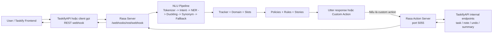
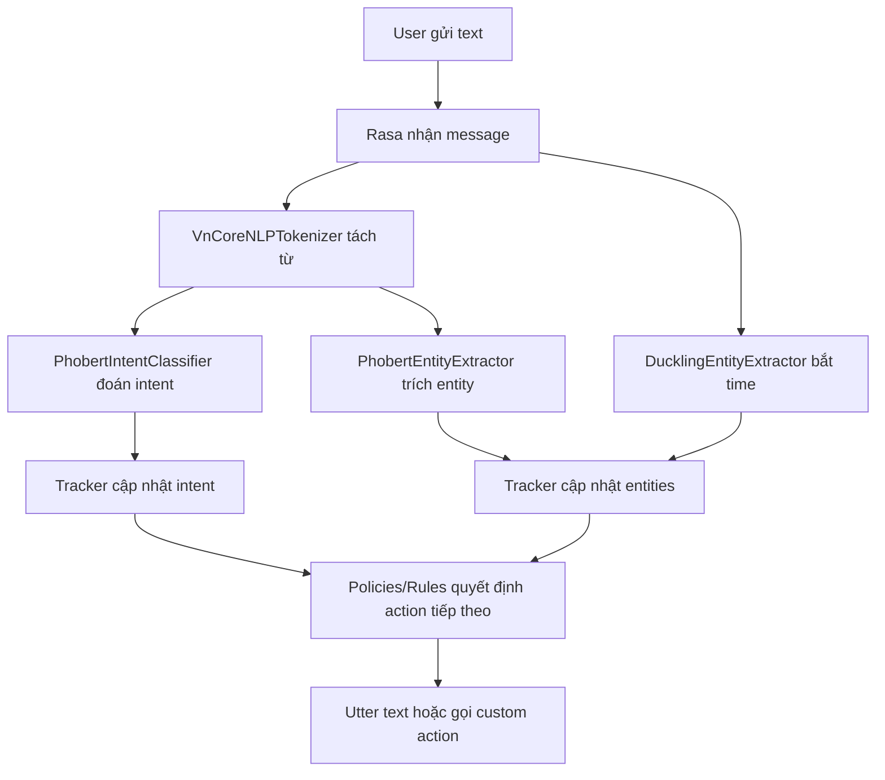

# Phân tích module và luồng hoạt động của `rasa`

Tài liệu này mô tả các module chính trong `Taskify/rasa`, chúng dùng để làm gì, phụ thuộc vào nhau ra sao, và luồng xử lý runtime/training hiện tại diễn ra như thế nào.

## 1. Bức tranh tổng thể

`rasa` trong repo này không chỉ là một bot Rasa thuần.
Nó gồm 4 lớp chính:

1. Lớp cấu hình và điều phối của Rasa:
   - `config.yml`
   - `domain.yml`
   - `data/rules.yml`
   - `data/stories.yml`
   - `credentials.yml`
   - `endpoints.yml`

2. Lớp NLU custom:
   - `custom_components/vncorenlp_tokenizer.py`
   - `custom_components/phobert_intent.py`
   - `custom_components/phobert_ner.py`

3. Lớp action server:
   - `actions/__init__.py`
   - `actions/task/task_actions.py`
   - `actions/note/note_actions.py`
   - `actions/fallback_actions.py`
   - `actions/common/*.py`
   - `actions/config.py`

4. Lớp dữ liệu train và script chuẩn bị dữ liệu:
   - `data/nlu/*.yml`
   - `data/phobert/generate_nlu.py`
   - `data/phobert/prepare_data.py`
   - `data/phobert/nlu_gen/*.py`
   - `data/phobert/train/*`
   - `data/model/intent_model/*`
   - `data/model/ner_model/*`

## 2. Sơ đồ kiến trúc runtime

## 3. Phân nhóm module

| Nhóm | File chính | Vai trò |
|---|---|---|
| Core config | `config.yml` | Khai báo pipeline NLU và policy đối thoại |
| Domain | `domain.yml` | Khai báo intents, entities, slots, responses, actions, forms |
| Dialogue rules | `data/rules.yml`, `data/stories.yml` | Quy định bot chọn action nào trong từng tình huống |
| Tokenizer | `custom_components/vncorenlp_tokenizer.py` | Tách từ tiếng Việt bằng VnCoreNLP |
| Intent classifier | `custom_components/phobert_intent.py` | Phân loại intent bằng PhoBERT fine-tuned |
| Entity extractor | `custom_components/phobert_ner.py` | Trích entity bằng PhoBERT NER fine-tuned |
| Time extractor | `DucklingEntityExtractor` trong `config.yml` | Bắt thực thể thời gian tuyệt đối/interval |
| Action server | `actions/*` | Xử lý nghiệp vụ task/note/fallback bằng gọi API |
| Training scripts | `data/phobert/*.py` | Sinh data train cho PhoBERT từ NLU YAML |
| Runtime model artifacts | `data/model/*` | Model intent và NER được custom component load lúc chạy |
| Smoke tests | `test_phobert.py`, `test_segmented.py` | Test nhanh model đã fine-tune |

## 4. Pipeline NLU đang dùng

Trong `config.yml`, pipeline hiện tại chạy theo thứ tự:

1. `custom_components.vncorenlp_tokenizer.VnCoreNLPTokenizer`
2. `custom_components.phobert_intent.PhobertIntentClassifier`
3. `custom_components.phobert_ner.PhobertEntityExtractor`
4. `DucklingEntityExtractor`
5. `EntitySynonymMapper`
6. `FallbackClassifier`

Ý nghĩa từng bước:

1. `VnCoreNLPTokenizer`
   - Nhận `message.text`
   - Tách từ tiếng Việt bằng VnCoreNLP
   - Trả ra list token Rasa
   - Nếu chưa cài `vncorenlp`, fallback sang `text.split()`

2. `PhobertIntentClassifier`
   - Load model từ `rasa/data/model/intent_model`
   - Dùng `AutoTokenizer` + `AutoModelForSequenceClassification`
   - Suy ra `intent` và `intent_ranking`
   - Không train bên trong Rasa, chỉ load model đã fine-tune sẵn

3. `PhobertEntityExtractor`
   - Load model từ `rasa/data/model/ner_model`
   - Lấy token do tokenizer trước đó sinh ra
   - Tự align subword PhoBERT về token gốc
   - Gom nhãn BIO thành entity span chuẩn của Rasa

4. `DucklingEntityExtractor`
   - Gọi service Duckling ở `http://localhost:8000`
   - Bắt entity `time`
   - Hữu ích cho các câu có mốc ngày giờ hoặc khoảng thời gian

5. `EntitySynonymMapper`
   - Chuẩn hóa entity synonym theo dữ liệu NLU

6. `FallbackClassifier`
   - Nếu confidence thấp hoặc mơ hồ thì đẩy về `nlu_fallback`

## 5. Policies và lớp điều phối hội thoại

`config.yml` đang dùng:

- `MemoizationPolicy`
- `RulePolicy`
- `UnexpecTEDIntentPolicy`
- `TEDPolicy`

Ý nghĩa vận hành:

- `RulePolicy` xử lý các flow chắc chắn, ví dụ:
  - `goodbye` -> `utter_goodbye`
  - `nlu_fallback` -> `action_fallback_gemini`
  - `create_task` -> activate form
  - submit form -> `action_create_task`
  - `delete_task` -> `action_delete_task`
  - `filter_tasks` -> `action_filter_tasks`

- `TEDPolicy` và `MemoizationPolicy` hỗ trợ các flow theo ngữ cảnh/stories.
- `UnexpecTEDIntentPolicy` giúp phát hiện trường hợp người dùng đi lệch khỏi luồng dự kiến.

## 6. Domain: bot biết những gì

`domain.yml` là nơi khai báo:

- `intents`
  - ví dụ: `create_task`, `filter_tasks`, `delete_task`, `create_note`, `search_notes`, `nlu_fallback`

- `entities`
  - ví dụ: `task_title`, `due_date`, `due_time`, `priority`, `task_status`, `note_title`, `note_text`

- `slots`
  - dùng để giữ trạng thái đã bóc tách từ message
  - ví dụ `task_title`, `priority`, `filter_query_state`, `note_keyword`

- `responses`
  - các câu trả lời tĩnh `utter_*`

- `actions`
  - các custom action cần action server thực thi

- `forms`
  - hiện tại có `create_task_form`

## 7. Luồng runtime chi tiết

### 7.1. Luồng phân tích message tổng quát

### 7.2. Luồng tạo task

Module tham gia:

- `domain.yml`
- `data/rules.yml`
- `custom_components/*`
- `actions/task/task_actions.py`
- `actions/common/text_utils.py`
- `actions/common/date_utils.py`
- `actions/common/api_utils.py`

Luồng:

1. User nói câu tạo task.
2. NLU trích `intent=create_task`, cùng các entity như `task_title`, `due_date`, `due_time`, `priority`.
3. `RulePolicy` kích hoạt `create_task_form`.
4. Nếu thiếu `task_title`, form hỏi lại bằng `utter_ask_task_title`.
5. `ValidateCreateTaskForm.validate_task_title()` cố gắng rút title thật từ message.
6. Khi form đủ dữ liệu, `action_create_task` chạy.
7. `ActionCreateTask` dùng:
   - `clean_task_title()` để làm sạch title
   - `build_due_datetime()` để ráp ngày giờ
   - `normalize_priority()` để chuẩn hóa priority
8. Action gọi `POST /api/internal/tasks/{userId}` tới TaskifyAPI.
9. Bot trả kết quả tạo task thành công/thất bại.
10. Slots của flow tạo task được reset.

### 7.3. Luồng lọc task

Module tham gia:

- `actions/task/task_actions.py`
- `actions/common/date_utils.py`
- `actions/common/text_utils.py`
- `actions/common/api_utils.py`

Luồng:

1. User hỏi kiểu “task quá hạn”, “task priority cao”, “task ngày mai”, “task chứa báo cáo”.
2. NLU bóc các entity như `task_status`, `priority`, `task_label`, `search_query`, `due_from`, `due_to`, `task_due_state`.
3. `ActionFilterTasks` dựng `state` bộ lọc từ:
   - entity
   - text thô
   - metadata từ frontend cho phân trang
4. Action suy ra:
   - `search`
   - `status`
   - `priority`
   - `label`
   - `dueFrom`
   - `dueTo`
   - `overdue`
5. Action gọi `GET /api/internal/tasks/{userId}` với query params phân trang.
6. Bot trả:
   - text summary
   - `json_message` kiểu `task_list_page`
7. Slot `filter_query_state` được giữ lại để frontend bấm next/prev vẫn dùng lại filter cũ.

### 7.4. Luồng xóa task

Module tham gia:

- `actions/task/task_actions.py`
- `actions/common/delete_match_utils.py`
- `actions/common/text_utils.py`
- `actions/common/api_utils.py`

Luồng:

1. User nói câu xóa task.
2. `ActionDeleteTask` lấy query xóa bằng `extract_delete_query()`.
3. Action tải danh sách task hiện tại từ API.
4. `pick_task_by_title_fuzzy()` chấm điểm fuzzy match theo title.
5. Nếu không match:
   - bot hỏi lại title
6. Nếu match đúng 1 task:
   - action xóa trực tiếp qua `POST /api/internal/tasks/{userId}/delete`
7. Nếu match nhiều task:
   - bot trả `json_message` kiểu `task_picker`
   - frontend cho người dùng chọn nhiều task để confirm
8. Khi frontend gửi metadata `confirm_delete_selection`:
   - action nhận `taskIds`
   - gọi batch delete
9. Nếu API trả `undoToken`:
   - bot trả payload `delete_result`
10. Nếu frontend gọi undo:
   - action nhận metadata `undo_delete`
   - gọi `POST /api/internal/tasks/{userId}/undo-delete`

### 7.5. Luồng tóm tắt tuần

Module tham gia:

- `actions/task/task_actions.py`
- `actions/common/text_utils.py`
- `actions/common/api_utils.py`

Luồng:

1. Intent `summarize_week` được nhận diện.
2. `ActionSummarizeWeek` gọi API lấy thống kê task.
3. Action ghép các số liệu như:
   - `completedThisWeek`
   - `pendingCount`
   - `overdueCount`
   - `highPriorityCount`
4. Bot trả summary dạng text kèm tip hành động tiếp theo.

### 7.6. Luồng note

Module tham gia:

- `actions/note/note_actions.py`
- `actions/common/api_utils.py`

Các action chính:

- `ActionCreateNote`
  - tạo note bằng `POST /api/internal/notes/{userId}`

- `ActionListNotes`
  - lấy note gần đây bằng `GET /api/internal/notes/{userId}?limit=5`
  - trả thêm `json_message` kiểu `note_picker`

- `ActionSearchNotes`
  - tìm note theo keyword

- `ActionTogglePinNote`
  - tìm note gần đúng
  - gọi API pin/unpin note

- `ActionUpdateNote`
  - có code xử lý update note

- `ActionDeleteNote`
  - có code xử lý delete note

### 7.7. Luồng fallback

Module tham gia:

- `FallbackClassifier`
- `data/rules.yml`
- `actions/fallback_actions.py`
- `actions/common/text_utils.py`
- `actions/config.py`

Luồng:

1. Confidence intent thấp hoặc message mơ hồ.
2. `FallbackClassifier` đẩy intent về `nlu_fallback`.
3. Rule gọi `action_fallback_gemini`.
4. Action:
   - detect locale
   - build prompt tiếng Việt hoặc tiếng Anh
   - gọi Gemini API nếu có `GEMINI_API_KEY`
5. Nếu Gemini lỗi hoặc không cấu hình:
   - dùng fallback text mặc định.

## 8. Cấu trúc action server và phụ thuộc nội bộ

### 8.1. `actions/config.py`

Chứa cấu hình dùng chung:

- `TASKIFY_API_URL`
- `RASA_API_KEY`
- `REQUEST_TIMEOUT`
- `GEMINI_API_KEY`
- `GEMINI_MODEL`
- `GEMINI_API_TIMEOUT`

Ngoài ra còn có:

- `_load_dotenv()` để nạp `.env`
- pattern regex giúp nhận diện tiếng Việt

### 8.2. `actions/common/api_utils.py`

Chứa helper giao tiếp API:

- `get_api_headers()`
  - sinh header `Content-Type` + `X-Rasa-Token`

- `split_sender()`
  - tách `sender_id` thành `user_id` và `session_id`
  - format hỗ trợ kiểu `user:session`

### 8.3. `actions/common/text_utils.py`

Vai trò:

- detect locale `vi/en`
- dịch chọn câu theo locale qua hàm `t()`
- làm sạch `task_title`
- bỏ phần metadata khỏi title
- bóc title từ entity hoặc từ raw text
- reset slot của flow create task

Đây là module rất quan trọng vì các action task phụ thuộc mạnh vào nó để hiểu câu người dùng theo kiểu ngôn ngữ tự nhiên.

### 8.4. `actions/common/date_utils.py`

Vai trò:

- parse ngày tự nhiên như `hôm nay`, `ngày mai`, `thứ hai`, `tuần sau`
- parse giờ như `9h`, `14:30`, `chiều`, `tối`
- ghép ngày + giờ thành `datetime`
- đọc interval/time từ Duckling entity
- normalize priority

### 8.5. `actions/common/delete_match_utils.py`

Vai trò:

- normalize query xóa task
- bỏ dấu tiếng Việt để match tốt hơn
- fuzzy match theo:
  - Levenshtein ratio
  - token overlap
  - contains bonus

Đây là helper trung tâm cho luồng xóa task nhiều lựa chọn.

### 8.6. `actions/common/format_utils.py`

Vai trò:

- format list task ra text dễ đọc
- chứa các helper `utter_*` dùng chung

## 9. Luồng training và nguồn dữ liệu

### 9.1. Luồng sinh NLU YAML

Module:

- `data/phobert/nlu_gen/shared.py`
- `data/phobert/nlu_gen/task.py`
- `data/phobert/nlu_gen/note.py`
- `data/phobert/nlu_gen/render.py`
- `data/phobert/generate_nlu.py`

Luồng:

1. Generator theo domain tạo intent examples.
2. `generate_nlu.py` render thành:
   - `data/nlu/shared.yml`
   - `data/nlu/task.yml`
   - `data/nlu/note.yml`

### 9.2. Luồng sinh data train PhoBERT

Module:

- `data/phobert/prepare_data.py`

Luồng:

1. Đọc `data/nlu/*.yml`
2. Bỏ file `*_draft.yml`, `*_disabled.yml`
3. Tách entity markup
4. Segment bằng VnCoreNLP
5. Tạo dữ liệu intent
6. Lọc duplicate theo cặp `intent + text`
7. Tạo dữ liệu NER BIO
8. Ghi ra:
   - `data/phobert/train/intent_train.json`
   - `data/phobert/train/ner_train.txt`

### 9.3. Runtime model path thực tế

Lưu ý:

- Custom component intent hiện load model từ:
  - `rasa/data/model/intent_model`

- Custom component NER hiện load model từ:
  - `rasa/data/model/ner_model`

Tức là runtime đang đọc `data/model/*`, không phải `data/phobert/train/*`.

## 10. Các file đặc biệt khác

- `credentials.yml`
  - bật REST channel để Taskify gọi webhook của Rasa

- `endpoints.yml`
  - khai báo action server tại `http://localhost:5055/webhook`

- `test_phobert.py`
  - test nhanh model intent và model NER trực tiếp bằng Transformers

- `test_segmented.py`
  - test nhanh intent model với chuỗi đã segment

- `file_query/task.md`
  - tài liệu mô tả hành vi chatbox task theo góc nhìn nghiệp vụ/frontend

## 11. Quan sát kỹ thuật hiện tại

### 11.1. Điểm mạnh của kiến trúc hiện tại

- NLU tiếng Việt được tùy biến tốt nhờ VnCoreNLP + PhoBERT.
- Tách rõ phần hiểu ngôn ngữ và phần gọi nghiệp vụ.
- Flow task có hỗ trợ:
  - form
  - filter state
  - picker nhiều lựa chọn
  - undo delete
- Có fallback sang Gemini khi NLU không chắc chắn.

### 11.2. Các điểm cần lưu ý

- `domain.yml` có khai báo:
  - `action_update_note`
  - `action_delete_note`

- `actions/note/note_actions.py` cũng có class:
  - `ActionUpdateNote`
  - `ActionDeleteNote`

- Nhưng `actions/__init__.py` hiện mới re-export:
  - `ActionCreateNote`
  - `ActionListNotes`
  - `ActionSearchNotes`
  - `ActionTogglePinNote`

Nếu action server đang dựa vào `actions` package để discover class, thì `ActionUpdateNote` và `ActionDeleteNote` có thể chưa được load như kỳ vọng.

### 11.3. Một lưu ý về tài liệu cũ và đường dẫn model

Trong repo có tài liệu cũ/khác nhắc đến PhoBERT model ở nhánh `data/phobert/...`.
Tuy nhiên code runtime hiện tại của custom component đang load model từ `data/model/...`.
Khi cập nhật model fine-tuned, cần đảm bảo copy đúng vào path mà component đang dùng.

## 12. Kết luận ngắn

Kiến trúc `rasa` hiện tại là mô hình lai:

- Rasa làm bộ điều phối hội thoại
- PhoBERT custom component làm NLU chính
- Duckling xử lý thời gian
- Action server gọi TaskifyAPI để xử lý nghiệp vụ thật

Nói ngắn gọn:

1. `custom_components/*` hiểu câu người dùng
2. `domain + rules + stories + policies` quyết định bước tiếp theo
3. `actions/*` thực thi nghiệp vụ thật
4. `data/phobert/*` tạo dữ liệu train cho PhoBERT
5. `data/model/*` chứa model runtime được load khi bot chạy
