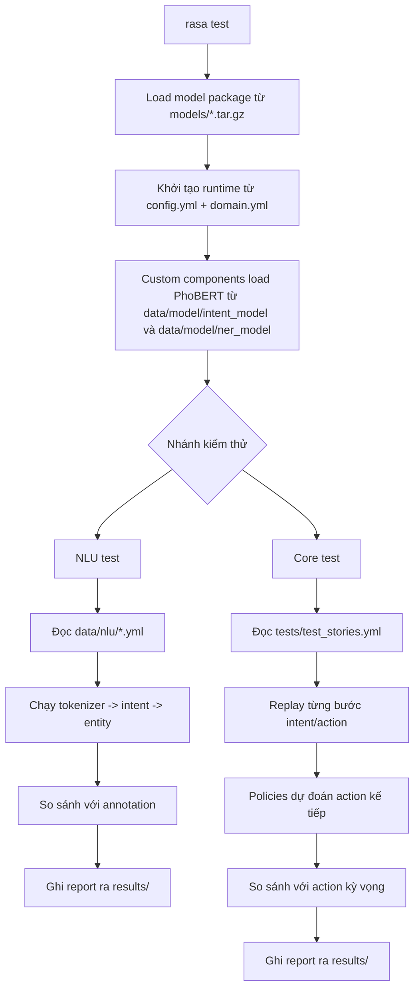
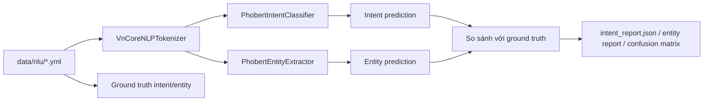
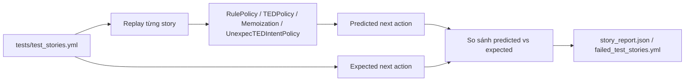

# Luồng `rasa test` trong Taskify

Tài liệu này giải thích riêng luồng `rasa test` trong repo `Taskify/rasa`, tập trung vào:

- `rasa test nlu`
- `rasa test core`
- dữ liệu nào được dùng để chấm
- kết quả được ghi ra đâu
- cần đọc kết quả theo ngữ cảnh nào của repo hiện tại

## 1. `rasa test` đang kiểm tra cái gì

Trong repo này, `rasa test` nên được hiểu là 2 lớp kiểm thử:

1. NLU test
   - Kiểm tra mô hình hiểu câu người dùng có đoán đúng `intent` và `entity` không.
2. Core test
   - Kiểm tra lớp điều phối hội thoại có chọn đúng `action`, `form`, `active_loop` theo stories/rules không.

Nói ngắn gọn:

- NLU test trả lời: "bot hiểu câu đúng chưa?"
- Core test trả lời: "sau khi hiểu rồi, bot có đi đúng luồng không?"

## 2. Sơ đồ tổng quát



## 3. Input thật mà repo này đang dùng

### 3.1. Model và cấu hình

- `rasa/models/*.tar.gz`
- `rasa/config.yml`
- `rasa/domain.yml`

### 3.2. Dữ liệu NLU để test

- `rasa/data/nlu/shared.yml`
- `rasa/data/nlu/task.yml`
- `rasa/data/nlu/note.yml`

Đây là nơi chứa:

- examples cho `intent`
- annotation cho `entity`
- synonym và các pattern liên quan NLU

### 3.3. Dữ liệu Core để test

- `rasa/tests/test_stories.yml`

File này hiện dùng cú pháp kiểu:

```yml
- story: kiểm thử lọc task
  steps:
    - intent: filter_tasks
    - action: action_filter_tasks
```

Điều đó có nghĩa:

- repo đang test hội thoại ở mức `intent -> action`
- đây không phải end-to-end test bằng raw user text

### 3.4. PhoBERT artifacts mà custom component thực sự load lúc test

- `rasa/data/model/intent_model`
- `rasa/data/model/ner_model`

Đây là điểm rất quan trọng của repo này:

- `rasa train` tạo model package trong `models/`
- nhưng lúc chạy test, custom components vẫn load PhoBERT runtime từ `data/model/*`

Vì vậy:

- nếu bạn fine-tune model mới nhưng chưa copy đúng vào `data/model/*`
- thì `rasa test` có thể đang chấm trên artifact cũ

## 4. Luồng `rasa test nlu`

Luồng NLU test trong repo này đi như sau:

1. Rasa nạp pipeline từ `config.yml`.
2. `VnCoreNLPTokenizer` tách từ tiếng Việt.
3. `PhobertIntentClassifier` dự đoán `intent`.
4. `PhobertEntityExtractor` dự đoán entity span theo nhãn BIO đã fine-tune.
5. `DucklingEntityExtractor` bổ sung entity thời gian nếu có.
6. Rasa so sánh kết quả dự đoán với annotation trong `data/nlu/*.yml`.
7. Rasa ghi các report đánh giá vào `rasa/results/`.

Sơ đồ:



## 5. Luồng `rasa test core`

Luồng Core test trong repo này đi như sau:

1. Rasa đọc `tests/test_stories.yml`.
2. Với mỗi story, Rasa replay tuần tự các bước khai báo trong `steps`.
3. Sau mỗi `intent` hoặc event, các policy dự đoán action tiếp theo.
4. Rasa so action dự đoán với action kỳ vọng trong story test.
5. Nếu lệch, case đó được ghi vào `failed_test_stories.yml`.
6. Report tổng hợp được ghi vào `story_report.json` và các biểu đồ liên quan.

Sơ đồ:



Điểm cần hiểu đúng:

- `rasa test core` chủ yếu kiểm tra quyết định hội thoại
- nó không thay thế integration test cho `actions/*`
- nghĩa là nó không nhằm chứng minh API trong `TaskifyAPI` đã trả dữ liệu đúng

Nó trả lời tốt câu hỏi:

- "intent này có dẫn bot sang đúng action không?"
- "form có được kích hoạt/thoát đúng không?"
- "rule fallback có bắn đúng không?"

Nó không trả lời trực tiếp câu hỏi:

- "action gọi API có trả về payload đúng không?"
- "logic xử lý trong `task_actions.py` có đúng với mọi edge case không?"

## 6. Kết quả trong `rasa/results/` nên đọc thế nào

Repo hiện đã có sẵn các file output như:

- `rasa/results/intent_report.json`
- `rasa/results/intent_errors.json`
- `rasa/results/intent_confusion_matrix.png`
- `rasa/results/PhobertEntityExtractor_report.json`
- `rasa/results/PhobertEntityExtractor_errors.json`
- `rasa/results/story_report.json`
- `rasa/results/failed_test_stories.yml`
- `rasa/results/story_confusion_matrix.png`

Ý nghĩa chính:

- `intent_report.json`
  - Precision / Recall / F1 theo từng intent
- `intent_errors.json`
  - Những câu bị đoán sai intent
- `PhobertEntityExtractor_report.json`
  - Precision / Recall / F1 theo từng entity
- `PhobertEntityExtractor_errors.json`
  - Những entity bị lệch span hoặc lệch nhãn
- `story_report.json`
  - Tỷ lệ bot chọn đúng action trong test stories
- `failed_test_stories.yml`
  - Những story fail và action dự đoán thực tế

## 7. Đọc nhanh một ví dụ fail hiện có trong repo

Trong `rasa/results/failed_test_stories.yml` hiện có case:

```yml
- story: kiểm thử lọc task
  steps:
    - intent: filter_tasks
    - action: action_filter_tasks  # predicted: action_default_fallback
```

Diễn giải:

1. Story test mong rằng khi gặp `filter_tasks`, bot phải đi vào `action_filter_tasks`.
2. Nhưng model/policy thực tế lại dự đoán `action_default_fallback`.
3. Điều này thường cho thấy vấn đề ở lớp dialogue flow:
   - rule/story chưa đủ rõ
   - policy bị lệch do dữ liệu train
   - ngưỡng fallback hoặc ngữ cảnh tracker làm bot đi sai nhánh

Điểm đáng lưu ý:

- đây không nhất thiết là lỗi của intent classifier
- có thể intent đúng, nhưng action tiếp theo bị chọn sai

## 8. Khi nào nên chạy lại `rasa test`

Nên chạy lại sau khi thay đổi một trong các nhóm sau:

- `rasa/data/nlu/*.yml`
- `rasa/data/rules.yml`
- `rasa/data/stories.yml`
- `rasa/tests/test_stories.yml`
- `rasa/domain.yml`
- `rasa/config.yml`
- `rasa/data/model/intent_model/*`
- `rasa/data/model/ner_model/*`

Nếu vừa đổi dữ liệu hoặc model, thứ tự hợp lý thường là:

1. cập nhật dữ liệu / PhoBERT artifact
2. chạy `rasa train`
3. chạy `rasa test`
4. đọc `results/` để xem lỗi nằm ở NLU hay Core

## 9. Lệnh gợi ý

```bash
rasa test
rasa test nlu --nlu data/nlu --out results
rasa test core --stories tests/test_stories.yml --out results
```

Ý nghĩa:

- `rasa test`
  - chạy tổng hợp cả NLU và Core
- `rasa test nlu`
  - chỉ chấm intent/entity
- `rasa test core`
  - chỉ chấm luồng hội thoại

## 10. Tóm tắt ngắn cho repo này

1. `rasa train` tạo gói model điều phối ở `models/`
2. `rasa test nlu` chấm khả năng hiểu ngôn ngữ trên `data/nlu/*.yml`
3. `rasa test core` chấm khả năng chọn action đúng trên `tests/test_stories.yml`
4. Custom PhoBERT trong repo vẫn phụ thuộc vào artifact thật ở `data/model/*`
5. Muốn đọc lỗi đúng hướng, cần tách bạch:
   - fail NLU
   - fail dialogue
   - fail action/API integration
