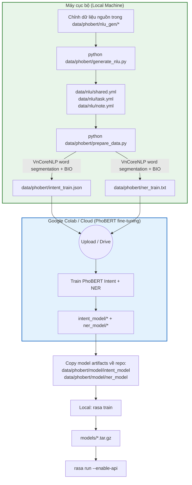

# Quy trình Huấn luyện Mô hình Rasa + PhoBERT (Luồng hiện tại)

Tài liệu này mô tả luồng đang dùng trong repo `Taskify/rasa`.

## 1. Sơ đồ quy trình (Pipeline)



## 2. Chi tiết phần Máy cục bộ (Local Machine)

1. `generate_nlu.py` (thay cho luồng cũ `refactor_nlu_v2.py`)
- Lệnh: `python data/phobert/generate_nlu.py`
- Sinh bộ dữ liệu NLU theo domain vào `data/nlu/*.yml`.
- Mặc định tạo các file: `shared.yml`, `task.yml`, `note.yml`.

2. `prepare_data.py` (tiền xử lý cho PhoBERT)
- Lệnh: `python data/phobert/prepare_data.py`
- Đọc dữ liệu từ `data/nlu/*.yml` (mặc định bỏ qua `*_draft.yml`, `*_disabled.yml`).
- Dùng VnCoreNLP để tách từ tiếng Việt.
- Sinh 2 file dùng cho fine-tuning PhoBERT:
  - `data/phobert/intent_train.json`
  - `data/phobert/ner_train.txt`

3. Huấn luyện Rasa sau khi có model PhoBERT đã fine-tune
- Copy artifact PhoBERT về đúng thư mục:
  - `data/phobert/model/intent_model`
  - `data/phobert/model/ner_model`
- Chạy: `rasa train`
- Kết quả: model Rasa đóng gói ở `models/*.tar.gz`.

## 3. Ghi chú quan trọng

- `refactor_nlu_v2.py` hiện là luồng cũ/deprecated; không dùng như entrypoint chính.
- Cần Java + VnCoreNLP jar để chạy `prepare_data.py`.
- Mặc định jar path trong script: `C:\Users\HPPC~1\VnCoreNLP\VnCoreNLP-1.2.jar`.
- Khi đổi dữ liệu NLU, cần chạy lại theo thứ tự:
  1. `python data/phobert/generate_nlu.py`
  2. `python data/phobert/prepare_data.py`
  3. Fine-tune PhoBERT (Colab/cloud) và cập nhật lại `data/phobert/model/*`
  4. `rasa train`

## 4. Ví dụ nhanh luồng dữ liệu

Câu gốc:
`"tạo task học tiếng anh vào ngày mai"`

Sau bước segmentation (VnCoreNLP):
`"tạo task học tiếng_anh vào ngày_mai"`

Trong `intent_train.json`:

```json
{
  "text": "tạo task học tiếng_anh vào ngày_mai",
  "intent": "create_task"
}
```

Trong `ner_train.txt` (BIO):

```text
tạo O
task O
học B-task_title
tiếng_anh I-task_title
vào O
ngày_mai B-due_date
```
