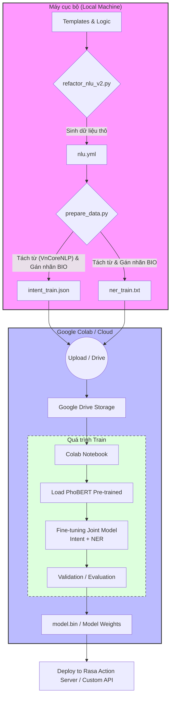

# Quy trình Huấn luyện Mô hình Rasa PhoBERT

Dưới đây là sơ đồ quy trình từ việc sinh dữ liệu NLU đến khi huấn luyện mô hình trên Google Colab.

## 1. Sơ đồ quy trình (Pipeline)



## 2. Chi tiết vai trò các File

### Giai đoạn Local (Tiền xử lý)
1.  **`refactor_nlu_v2.py` (Máy sinh dữ liệu):**
    *   Chứa các template và logic để tạo ra hàng loạt ví dụ huấn luyện.
    *   Sản phẩm đầu ra: `nlu.yml` (Định dạng Rasa chuẩn).
2.  **`prepare_data.py` (Tiền xử lý cho PhoBERT):**
    *   Đọc file `nlu.yml`.
    *   Sử dụng **VnCoreNLP** để tách từ (Word Segmentation) cho tiếng Việt (VD: `học tập` -> `học_tập`).
    *   Gán nhãn **BIO** cho các thực thể (NER).
    *   Sản phẩm đầu ra: `intent_train.json` và `ner_train.txt`.

### Giai đoạn Cloud (Huấn luyện)
1.  **Google Drive:** Lưu trữ các file dữ liệu đã tách từ để Colab có thể truy cập.
2.  **Google Colab:**
    *   Sử dụng GPU để huấn luyện mô hình PhoBERT-base.
    *   Huấn luyện song song (Joint Learning) cả Intent Classification và Named Entity Recognition (NER).
    *   Sản phẩm đầu ra: `model.bin` (Trọng số mô hình đã qua tinh chỉnh).

## 3. Lưu ý quan trọng
*   Luôn chạy `refactor_nlu_v2.py` trước nếu có thay đổi về script sinh dữ liệu.
*   Cần đảm bảo môi trường Java đã được cài đặt đúng trên máy Local để `prepare_data.py` gọi được VnCoreNLP.
*   File `intent_train.json` và `ner_train.txt` phải được đồng bộ lên Drive mỗi khi cập nhật dữ liệu mới.

## 4. Ví dụ minh họa luồng dữ liệu

Để hiểu cách dữ liệu biến đổi, hãy nhìn vào hành trình của câu lệnh sau:

**Câu gốc:** `"tạo task học tiếng anh vào ngày mai"`

### Bước 1: Qua VnCoreNLP (Tách từ - Word Segmentation)
VnCoreNLP nhận diện các từ ghép và nối chúng lại bằng dấu gạch dưới `_`.
*   **Kết quả:** `"tạo task học tiếng_anh vào ngày_mai"`

### Bước 2: Qua prepare_data.py (Gán nhãn BIO)
Dữ liệu được chia vào 2 file huấn luyện chuẩn cho PhoBERT:

**File `intent_train.json` (Dạng JSON):**
Dùng để huấn luyện mô hình nhận diện ý định "Tạo task".
```json
{
  "text": "tạo task học tiếng_anh vào ngày_mai",
  "intent": "create_task"
}
```

**File `ner_train.txt` (Dạng BIO Tagging):**
Dùng để huấn luyện mô hình nhận diện thực thể (Tên task và Thời hạn).
```text
tạo         O
task        O
học         B-task_title
tiếng_anh   I-task_title
vào         O
ngày_mai    B-due_date
```

*   **B- (Begin):** Bắt đầu thực thể (Từ "học").
*   **I- (Inside):** Tiếp tục thực thể (Từ "tiếng_anh").
*   **O (Outside):** Không phải thực thể.
