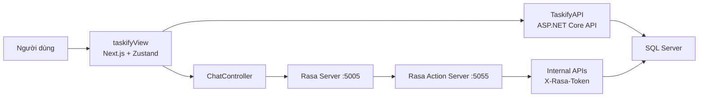

# Mục lục hệ thống Taskify

## Mục tiêu của tài liệu này
Tài liệu này là điểm bắt đầu cho toàn bộ bộ phân tích hệ thống Taskify. Mục tiêu là giúp người đọc hoặc ChatGPT nắm được hệ thống gồm những phần nào, nên đọc theo thứ tự nào, và mỗi tài liệu phía sau sẽ giải thích khía cạnh gì của hệ thống.

## Tại sao phần này quan trọng
Nếu không có một file điều hướng trung tâm, người đọc dễ bị lạc giữa nhiều khái niệm như frontend, backend, Rasa, internal API, session chat, AI fallback. File này giúp tạo bản đồ tổng quát trước khi đi vào chi tiết.

## Giới thiệu ngắn về hệ thống
Taskify là một hệ thống quản lý công việc cá nhân có tích hợp trợ lý hội thoại AI. Hệ thống không chỉ hỗ trợ CRUD cho task mà còn mở rộng sang ghi chú, tài chính cá nhân, phiên tập trung, mục tiêu hằng ngày và quản trị người dùng. Điểm khác biệt của Taskify là chatbot không chỉ trả lời văn bản mà còn có thể thao tác lên dữ liệu thật thông qua chuỗi `Frontend -> TaskifyAPI -> Rasa -> Internal API -> Database`.

## Sơ đồ kiến trúc tổng quan

## Thứ tự đọc đề xuất
1. `00_muc_luc_he_thong.md`: xem bản đồ tổng thể.
2. `01_tong_quan_nghiep_vu_va_pham_vi_he_thong.md`: hiểu bài toán và các phân hệ.
3. `02_kien_truc_tong_the_va_thanh_phan.md`: hiểu cách hệ thống được chia thành 3 tầng.
4. `03_du_lieu_va_mo_hinh_mien_nghiep_vu.md`: hiểu dữ liệu cốt lõi và quan hệ giữa các thực thể.
5. `04_luong_xu_ly_frontend_va_trai_nghiem_nguoi_dung.md`: hiểu hành trình người dùng và phía giao diện.
6. `05_backend_api_xac_thuc_va_nghiep_vu.md`: hiểu API và các quy tắc backend.
7. `06_he_thong_ai_chat_rasa_va_internal_api.md`: hiểu luồng AI chat, Rasa và API nội bộ.
8. `07_luong_nghiep_vu_chinh_theo_kich_ban.md`: xem các use case đầu-cuối.
9. `08_rang_buoc_ky_thuat_cau_hinh_va_trien_khai.md`: hiểu điều kiện vận hành, cấu hình, rủi ro kỹ thuật.

## Mô tả nhanh từng tài liệu
| Tài liệu | Nội dung chính | Khi nào nên đọc |
| --- | --- | --- |
| `01` | Bài toán, vai trò, phân hệ, phạm vi | Khi cần hiểu sản phẩm làm gì |
| `02` | Kiến trúc 3 tầng và giao tiếp giữa các tầng | Khi cần hiểu cấu trúc triển khai |
| `03` | Thực thể dữ liệu và vòng đời dữ liệu | Khi cần viết phần phân tích dữ liệu |
| `04` | Frontend, màn hình, state, trải nghiệm người dùng | Khi cần mô tả giao diện và luồng thao tác |
| `05` | Public API, JWT, quyền, nghiệp vụ backend | Khi cần mô tả lớp dịch vụ |
| `06` | AI chat, Rasa, internal API, fallback | Khi cần mô tả phần thông minh của hệ thống |
| `07` | Use case và kịch bản end-to-end | Khi cần viết chương phân tích thiết kế |
| `08` | Cấu hình, môi trường chạy, rủi ro, cải tiến | Khi cần viết đánh giá và triển khai |

## Từ điển thuật ngữ
| Thuật ngữ | Ý nghĩa trong hệ thống | Mapping code |
| --- | --- | --- |
| Task | Công việc cần theo dõi và xử lý | `TaskItem` |
| Note | Ghi chú cá nhân | `Note` |
| Finance Entry | Bản ghi thu chi cá nhân | `FinanceEntry` |
| Finance Category | Nhóm phân loại khoản thu chi | `FinanceCategory` |
| Focus Session | Phiên tập trung/pomodoro | `FocusSession` |
| Daily Goal | Mục tiêu trong ngày | `DailyGoal` |
| Chat Session | Một cuộc hội thoại AI của người dùng | `ChatSession` |
| Chat Message | Một tin nhắn trong cuộc hội thoại | `ChatMessage` |
| Internal API | API backend chỉ dành cho Rasa action server | `api/internal/*` |
| AI Fallback | Nhà cung cấp AI dự phòng khi cần hỗ trợ ngoài Rasa | `Gemini`, `Ollama`, `UserAiFallbackSettings` |

## Thành phần liên quan
- `taskifyView`: giao diện web.
- `TaskifyAPI`: backend chính và API công khai.
- `rasa`: NLU, dialogue, custom actions.
- `phan_tich_do_an`: bộ tài liệu này.

## Luồng xử lý tổng quát
1. Người dùng thao tác trên giao diện Next.js.
2. Frontend gọi REST API của `TaskifyAPI` bằng JWT.
3. Backend xác thực, xử lý nghiệp vụ, lưu dữ liệu vào SQL Server.
4. Khi người dùng chat, backend chuyển tiếp yêu cầu sang Rasa.
5. Rasa có thể gọi `internal API` để thao tác lên task, note, finance hoặc AI fallback.
6. Kết quả quay lại backend rồi được lưu và trả về frontend.

## Dữ liệu vào/ra
- Đầu vào của bộ tài liệu: source code hiện tại của repo Taskify.
- Đầu ra của bộ tài liệu: tập hợp mô tả hệ thống độc lập với code, có thể dùng làm nguồn cho ChatGPT hoặc tài liệu Word.

## Ràng buộc
- Tài liệu ưu tiên diễn giải hành vi hệ thống, không chép code dài.
- Phải giữ tên khái niệm kỹ thuật thật trong code để tiện đối chiếu.
- Phải đủ rõ để người ngoài repo vẫn theo dõi được luồng hệ thống.

## Tình huống lỗi
- Nếu người đọc bỏ qua `02` và `06`, họ dễ hiểu thiếu phần AI chat là điểm khác biệt lớn nhất.
- Nếu chỉ đọc `04` mà không đọc `05`, họ sẽ biết màn hình nhưng không hiểu ràng buộc nghiệp vụ và quyền truy cập.

## Liên hệ file khác
- Sau file này nên đọc [`01_tong_quan_nghiep_vu_va_pham_vi_he_thong.md`](C:\Users\HP PC\source\repos\Taskify\phan_tich_do_an\01_tong_quan_nghiep_vu_va_pham_vi_he_thong.md).
- Khi cần hiểu ngay phần thông minh của hệ thống, có thể nhảy đến [`06_he_thong_ai_chat_rasa_va_internal_api.md`](C:\Users\HP PC\source\repos\Taskify\phan_tich_do_an\06_he_thong_ai_chat_rasa_va_internal_api.md).
