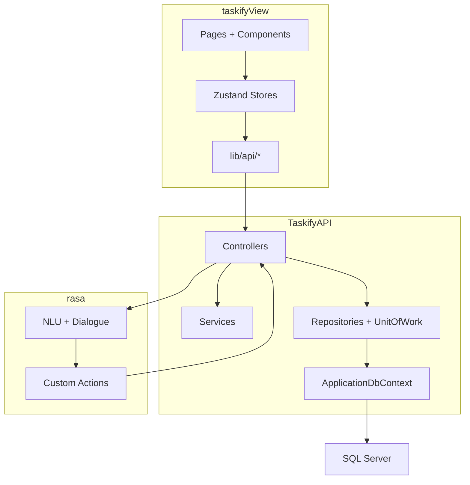

# Kiến trúc tổng thể và các thành phần của Taskify

## Mục tiêu của tài liệu này
Tài liệu này mô tả cấu trúc kỹ thuật tổng thể của Taskify: các lớp hệ thống, trách nhiệm của từng lớp, cách các lớp giao tiếp với nhau và lý do hệ thống được tách như hiện tại.

## Tại sao phần này quan trọng
Đây là phần nối giữa “hệ thống làm gì” và “hệ thống được xây như thế nào”. Phần này đặc biệt quan trọng khi viết chương kiến trúc tổng thể trong tài liệu Word.

## Mô hình kiến trúc 3 tầng mở rộng
Taskify hiện được tổ chức thành ba khối chính:

| Khối | Công nghệ | Vai trò |
| --- | --- | --- |
| `taskifyView` | Next.js, React, TypeScript, Zustand | Giao diện người dùng và điều phối state ở phía client |
| `TaskifyAPI` | ASP.NET Core 8, EF Core, Identity, JWT | API công khai, xác thực, nghiệp vụ và cầu nối sang Rasa |
| `rasa` | Rasa, Python, custom actions | Hiểu ngôn ngữ tự nhiên và chuyển thành hành động nghiệp vụ |

## Sơ đồ thành phần

## Vai trò của từng khối
### 1. `taskifyView`
Frontend chịu trách nhiệm hiển thị giao diện, tiếp nhận thao tác người dùng, lưu token ở client, giữ state bằng các store như `auth-store`, `task-store`, `chat-session-store`, và gọi các API tương ứng.

### 2. `TaskifyAPI`
Backend là lớp trung tâm về bảo mật và nghiệp vụ. Tại đây hệ thống:
- Xác thực JWT.
- Kiểm tra role và quyền truy cập.
- Tổ chức dữ liệu qua `ApplicationDbContext`, Repository, Unit of Work.
- Cung cấp public API cho frontend.
- Proxy chat sang Rasa bằng `RasaChatService`.
- Cung cấp `internal API` cho action server.

### 3. `rasa`
Rasa chịu trách nhiệm hiểu câu nói người dùng. Khi phát hiện người dùng muốn tạo task, tìm task, xóa task, tạo note hoặc ghi nhận tài chính, Rasa có thể gọi custom action tương ứng để truy cập `TaskifyAPI` thông qua `internal API`.

## Các cổng mặc định đang dùng
| Thành phần | Cổng/địa chỉ | Ghi chú |
| --- | --- | --- |
| Frontend | `http://localhost:3000` | Next.js |
| Rasa server | `http://localhost:5005` | REST webhook và parse endpoint |
| Rasa action server | `http://localhost:5055` | Custom actions |
| TaskifyAPI | theo launch profile/dev runtime | Backend chính, public API và internal API |

## Hai kiểu giao tiếp chính
### Public API qua JWT
Frontend gọi `TaskifyAPI` bằng header `Authorization: Bearer {token}`. Cách này dùng cho toàn bộ thao tác bình thường của người dùng như task, note, finance, focus, admin, settings, chat.

### Internal API qua `X-Rasa-Token`
Rasa action server không dùng JWT của người dùng để thao tác trực tiếp với dữ liệu. Thay vào đó, action server gọi các endpoint nội bộ và gửi header `X-Rasa-Token`. Backend kiểm tra khóa này với cấu hình `Rasa:ApiKey`.

## Tại sao hệ thống tách 3 tầng
| Lý do | Ý nghĩa |
| --- | --- |
| Tách UI khỏi nghiệp vụ | Frontend chỉ tập trung vào trải nghiệm người dùng |
| Tách AI khỏi backend chính | Rasa có thể huấn luyện, mở rộng intent và custom actions độc lập |
| Giữ backend làm lớp kiểm soát | Mọi truy cập dữ liệu đều đi qua backend để giữ bảo mật và ràng buộc nghiệp vụ |

## Ưu điểm kiến trúc hiện tại
- Rõ ràng trách nhiệm giữa UI, API và NLU.
- Backend vẫn là điểm kiểm soát duy nhất đối với dữ liệu thật.
- Dễ mở rộng thêm intent hoặc action mới ở Rasa mà không phải sửa toàn bộ frontend.
- Cho phép bổ sung `AI fallback` như Gemini hoặc Ollama mà không đẩy logic đó lên frontend.

## Nhược điểm và đánh đổi
- Hệ thống phụ thuộc vào nhiều tiến trình local cùng lúc.
- Luồng chat đi qua nhiều tầng nên dễ phát sinh timeout hoặc khó debug.
- Phần AI phụ thuộc mạnh vào độ ổn định của Rasa, action server và internal API.
- Một số cấu hình hiện mang tính môi trường phát triển, chưa phải cấu trúc production đầy đủ.

## Thành phần liên quan
- `taskifyView/package.json`, `taskifyView/app/*`, `taskifyView/lib/*`
- `TaskifyAPI/Program.cs`, `TaskifyAPI/Controllers/*`, `TaskifyAPI/Services/*`
- `rasa/config.yml`, `rasa/domain.yml`, `rasa/actions/*`

## Luồng xử lý tổng thể
1. Frontend nhận tương tác.
2. Frontend gọi `TaskifyAPI`.
3. Backend xác thực và xử lý nghiệp vụ hoặc truy xuất DB.
4. Nếu là chat, backend gọi Rasa.
5. Nếu Rasa cần dữ liệu thật, action server gọi internal API của backend.
6. Kết quả quay lại frontend.

## Dữ liệu vào/ra
- Đầu vào: HTTP request, JWT, chat message, metadata.
- Đầu ra: JSON response, persisted entities, assistant replies.

## Ràng buộc
- Dữ liệu quan trọng chỉ đi qua backend.
- Rasa không chạm DB trực tiếp.
- Phần AI chỉ đáng tin khi cả Rasa server và action server đều sẵn sàng.

## Tình huống lỗi
- Rasa timeout: backend trả fallback message.
- Invalid `X-Rasa-Token`: internal API trả `401`.
- Token JWT hết hạn: frontend bị đẩy về trang đăng nhập.

## Liên hệ file khác
- Để hiểu dữ liệu nằm ở đâu và liên kết ra sao, đọc [`03_du_lieu_va_mo_hinh_mien_nghiep_vu.md`](C:\Users\HP PC\source\repos\Taskify\phan_tich_do_an\03_du_lieu_va_mo_hinh_mien_nghiep_vu.md).
- Để hiểu chi tiết chuỗi chat AI, đọc [`06_he_thong_ai_chat_rasa_va_internal_api.md`](C:\Users\HP PC\source\repos\Taskify\phan_tich_do_an\06_he_thong_ai_chat_rasa_va_internal_api.md).
