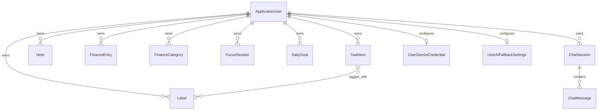

# Dữ liệu và mô hình miền nghiệp vụ của Taskify

## Mục tiêu của tài liệu này
Tài liệu này mô tả các thực thể dữ liệu trung tâm của Taskify, ý nghĩa của chúng trong nghiệp vụ, các trường dữ liệu quan trọng và quan hệ khái niệm giữa các thực thể.

## Tại sao phần này quan trọng
Mọi phân hệ trong Taskify đều xoay quanh dữ liệu. Khi người đọc hiểu rõ mô hình dữ liệu, họ sẽ dễ hiểu API, luồng nghiệp vụ và cách AI thao tác lên hệ thống.

## Danh sách thực thể chính
| Thực thể | Vai trò nghiệp vụ | Owner |
| --- | --- | --- |
| `ApplicationUser` | Tài khoản người dùng | Hệ thống |
| `TaskItem` | Công việc cá nhân | Người dùng |
| `Label` | Nhãn phân loại task | Người dùng |
| `Note` | Ghi chú cá nhân | Người dùng |
| `FinanceEntry` | Bản ghi thu chi | Người dùng |
| `FinanceCategory` | Danh mục tài chính | Người dùng |
| `FocusSession` | Phiên tập trung | Người dùng |
| `DailyGoal` | Mục tiêu trong ngày | Người dùng |
| `ChatSession` | Phiên hội thoại AI | Người dùng |
| `ChatMessage` | Tin nhắn trong hội thoại | Thuộc một `ChatSession` |
| `TaskDeleteUndoToken` | Token hỗ trợ hoàn tác xóa task | Hệ thống theo user/session |
| `UserGeminiCredential` | API key Gemini theo người dùng | Người dùng |
| `UserAiFallbackSettings` | Cấu hình nhà cung cấp AI dự phòng | Người dùng |

## Mô tả từng thực thể
### `ApplicationUser`
- Mục đích: đại diện cho một tài khoản có thể đăng nhập.
- Trường quan trọng: `Id`, `Email`, `UserName`, `AvatarUrl`, thông tin role qua Identity.
- Lifecycle: được tạo khi đăng ký hoặc admin tạo; sau đó dùng để sở hữu gần như toàn bộ dữ liệu cá nhân.

### `TaskItem`
- Mục đích: lưu một công việc cụ thể.
- Trường quan trọng: `Id`, `Title`, `Description`, `Priority`, `Status`, `DueDate`, `CreatedAt`, `IsDeleted`, `DeletedAt`, `UserId`.
- Lifecycle: tạo mới, cập nhật, đổi trạng thái, soft delete, có thể undo xóa trong một số luồng chat.

### `Label`
- Mục đích: gắn nhãn cho task.
- Trường quan trọng: `Id`, `Name`, `Color`, `UserId`, `CreatedAt`.
- Quan hệ: many-to-many với `TaskItem`.

### `Note`
- Mục đích: ghi chú cá nhân độc lập với task.
- Trường quan trọng: `Id`, `Title`, `Content`, `IsPinned`, `CreatedAt`, `UpdatedAt`, `UserId`.
- Lifecycle: tạo, cập nhật, ghim, bỏ ghim, xóa.

### `FinanceEntry`
- Mục đích: ghi nhận từng khoản thu chi.
- Trường quan trọng: `Id`, `Date`, `Category`, `Description`, `Amount`, `CreatedAt`, `UpdatedAt`, `UserId`.
- Lifecycle: tạo từ UI hoặc AI, sửa, xóa, dùng để tổng hợp thống kê.

### `FinanceCategory`
- Mục đích: quản lý nhóm phân loại cho `FinanceEntry`.
- Trường quan trọng: `Id`, `Name`, `CreatedAt`, `UserId`.
- Ràng buộc: public API không cho xóa category nếu đang được dùng; internal API có thể tự tạo category khi cần.

### `FocusSession`
- Mục đích: lưu một phiên tập trung.
- Trường quan trọng: `Id`, `DurationMinutes`, `StartedAt`, `EndedAt`, `BreaksTaken`, `IsCompleted`, `UserId`.
- Lifecycle: start, end, thống kê theo ngày/tuần.

### `DailyGoal`
- Mục đích: lưu mục tiêu trong ngày.
- Trường quan trọng: `Id`, `Title`, `IsCompleted`, `CreatedAt`, `UserId`.
- Lifecycle: tạo, toggle hoàn thành, xóa, clear completed.

### `ChatSession`
- Mục đích: gom các tin nhắn thành một cuộc hội thoại có ngữ cảnh.
- Trường quan trọng: `Id`, `Title`, `CreatedAt`, `UpdatedAt`, `UserId`.
- Lifecycle: tạo khi người dùng bắt đầu chat, cập nhật `UpdatedAt` khi có tin nhắn mới, có thể xóa.

### `ChatMessage`
- Mục đích: lưu từng tin nhắn user hoặc assistant.
- Trường quan trọng: `Id`, `SessionId`, `Role`, `Text`, `MetadataJson`, `SentAt`.
- Vai trò đặc biệt của `MetadataJson`: giữ payload phụ như assistant action result, undo token, parse metadata.

### `TaskDeleteUndoToken`
- Mục đích: phục vụ việc hoàn tác xóa task.
- Vai trò nghiệp vụ: giữ khả năng khôi phục các task vừa bị soft delete trong giới hạn thời gian.

### `UserGeminiCredential`
- Mục đích: lưu cấu hình API key Gemini theo từng user.
- Vai trò nghiệp vụ: cho phép mỗi user tự chọn nguồn AI dự phòng riêng.

### `UserAiFallbackSettings`
- Mục đích: lưu provider AI dự phòng đang được chọn và thông tin Ollama.
- Trường quan trọng: `ActiveProvider`, `OllamaBaseUrl`, `OllamaModel`, các mốc validate.

## Enum và trạng thái chính
| Nhóm | Giá trị | Ý nghĩa |
| --- | --- | --- |
| `TaskPriority` | `low`, `medium`, `high` | Mức ưu tiên công việc |
| `TaskItemStatus` | `todo`, `in-progress`, `completed` | Trạng thái xử lý task |
| `ChatMessageRole` | `user`, `assistant` | Vai trò tin nhắn trong hội thoại |
| `AiProvider` | `Gemini`, `Ollama` | Nhà cung cấp AI fallback |

## Bảng dữ liệu nên mô tả rõ trong Word
| Kiểu dữ liệu | Các trường cốt lõi |
| --- | --- |
| `Task` | `id`, `title`, `description`, `priority`, `status`, `dueDate`, `labels` |
| `Note` | `id`, `title`, `content`, `isPinned` |
| `FinanceEntry` | `id`, `date`, `category`, `description`, `amount` |
| `FocusSession` | `id`, `durationMinutes`, `startedAt`, `endedAt`, `breaksTaken`, `isCompleted` |
| `ChatSession` | `id`, `title`, `createdAt`, `updatedAt` |
| `ChatMessage` | `id`, `role`, `text`, `metadataJson`, `sentAt` |
| `AiFallbackSettings` | `activeProvider`, `gemini`, `ollama` |
| `GeminiCredentialStatus` | `configured`, `status`, `lastValidatedAtUtc`, `lastValidationError` |

## Sơ đồ quan hệ dữ liệu khái niệm

## Thành phần liên quan
- `TaskifyAPI/Model/*`
- `TaskifyAPI/Data/ApplicationDbContext.cs`
- `taskifyView/lib/types.ts`

## Luồng xử lý dữ liệu
1. User được xác định bằng `ApplicationUser`.
2. Mỗi phân hệ cá nhân đều gắn `UserId`.
3. Frontend nhận dữ liệu dưới dạng DTO hoặc type đơn giản hơn.
4. Chat dùng `ChatSession` và `ChatMessage` để lưu ngữ cảnh.
5. AI fallback đọc thêm cấu hình từ `UserGeminiCredential` và `UserAiFallbackSettings`.

## Dữ liệu vào/ra
- Đầu vào: request JSON, user claims, chat message, form data.
- Đầu ra: entity persisted, DTO response, metadata chat, thống kê tổng hợp.

## Ràng buộc
- Dữ liệu người dùng phải được cách ly bằng `UserId`.
- `TaskItem` hỗ trợ soft delete chứ không xóa cứng trong mọi trường hợp.
- `ChatMessage.MetadataJson` có thể chứa dữ liệu phụ trợ chứ không chỉ text thuần.

## Tình huống lỗi
- Dùng category tài chính không hợp lệ từ public API sẽ bị từ chối.
- Truy cập thực thể không thuộc owner sẽ trả `Forbid` hoặc `NotFound` tùy controller.
- Dữ liệu AI config không hợp lệ sẽ ngăn việc kích hoạt provider.

## Liên hệ file khác
- Để thấy dữ liệu này xuất hiện như thế nào trên UI, đọc [`04_luong_xu_ly_frontend_va_trai_nghiem_nguoi_dung.md`](C:\Users\HP PC\source\repos\Taskify\phan_tich_do_an\04_luong_xu_ly_frontend_va_trai_nghiem_nguoi_dung.md).
- Để thấy các entity được thao tác bởi API nào, đọc [`05_backend_api_xac_thuc_va_nghiep_vu.md`](C:\Users\HP PC\source\repos\Taskify\phan_tich_do_an\05_backend_api_xac_thuc_va_nghiep_vu.md).
