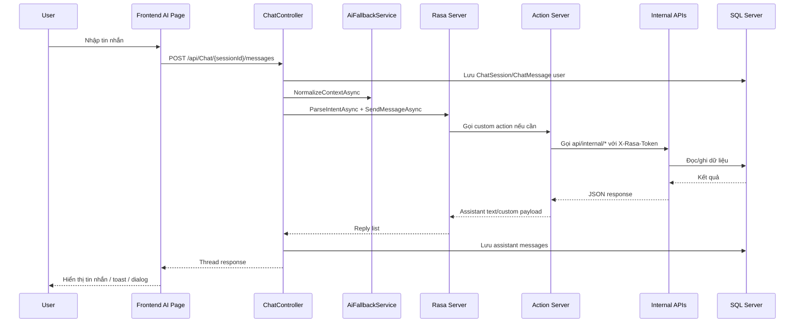

# Hệ thống AI chat, Rasa và internal API của Taskify

## Mục tiêu của tài liệu này
Tài liệu này mô tả chi tiết phân hệ AI chat của Taskify, bao gồm frontend chat, `ChatController`, `RasaChatService`, Rasa server, action server, internal API và AI fallback.

## Tại sao phần này quan trọng
Đây là phần làm cho Taskify khác với một ứng dụng CRUD thông thường. Nếu người đọc hiểu file này, họ sẽ hiểu “luồng thông minh” của hệ thống và cách ngôn ngữ tự nhiên được biến thành thao tác dữ liệu thật.

## Các thành phần tham gia
| Thành phần | Vai trò |
| --- | --- |
| `taskifyView/app/(dashboard)/ai/page.tsx` | Màn hình chat và bộ điều phối UI |
| `chat-session-store` | Giữ sessions và messages ở client |
| `ChatController` | API trung tâm của chat |
| `AiFallbackService` | Chuẩn hóa ngữ cảnh và gọi provider AI fallback khi cần |
| `RasaChatService` | Gọi parse endpoint và REST webhook của Rasa |
| `Rasa Server` | NLU + dialogue management |
| `Rasa Action Server` | Chứa custom actions bằng Python |
| `Internal APIs` | Cầu nối để Rasa thao tác dữ liệu thật |

## Sơ đồ luồng chat đầy đủ

## Ý nghĩa của `sender = userId:sessionId`
Trong chat, backend ghép `userId` và `sessionId` thành một sender string như `userId:sessionId`. Cách này giúp action server biết:
- ai là chủ dữ liệu cần thao tác,
- tin nhắn thuộc phiên hội thoại nào,
- cùng lúc vẫn giữ được ngữ cảnh giữa Rasa và hệ thống backend.

## Chuỗi xử lý chi tiết
### Bước 1. Frontend gửi tin nhắn
`chat-session-store` tạo optimistic user message rồi gọi `chatApi.sendMessage`.

### Bước 2. Backend tạo hoặc lấy session
`ChatController` kiểm tra `sessionId`. Nếu chưa có session tương ứng cho user thì tạo mới `ChatSession`.

### Bước 3. Chuẩn hóa ngữ cảnh
`AiFallbackService.NormalizeContextAsync` có thể dùng provider đang chọn để làm rõ câu hỏi dựa trên lịch sử chat. Nếu không có provider fallback, hệ thống dùng nguyên câu gốc.

### Bước 4. Parse intent
`RasaChatService.ParseIntentAsync` gọi `/model/parse` để backend biết dự đoán intent và lưu metadata hữu ích vào lịch sử chat.

### Bước 5. Gửi sang Rasa webhook
Backend gọi `/webhooks/rest/webhook` kèm `sender`, `message`, và có thể kèm `metadata`.

### Bước 6. Rasa chọn action
Rasa phân tích intent, entity, state của conversation rồi quyết định chỉ trả text hay gọi custom action.

### Bước 7. Action server gọi internal API
Nếu cần dữ liệu thật, custom action Python gọi vào một trong các endpoint:
- `api/internal/tasks`
- `api/internal/notes`
- `api/internal/finance`
- `api/internal/ai/fallback`

### Bước 8. Kết quả quay lại backend và frontend
Backend lưu assistant messages, sau đó frontend hiển thị chúng. Nếu `metadataJson` chứa payload đặc biệt như delete result/undo result thì UI có thể hiển thị toast hoặc nút hành động.

## Các nhóm custom action hiện có
| Nhóm | Vai trò |
| --- | --- |
| `task_actions.py` | List, create, delete, summarize, confirm task actions |
| `note_actions.py` | Tạo, tìm, cập nhật, xóa ghi chú |
| `finance_actions.py` | Tạo, tìm, sửa, xóa dữ liệu tài chính |
| `fallback_actions.py` | Gọi AI fallback khi Rasa cần câu trả lời ngoài rule/action cứng |

## Internal API hiện có
| Endpoint nhóm | Mục đích | Xác thực |
| --- | --- | --- |
| `api/internal/tasks/{userId}` | Lấy, tạo, xóa, undo, truy vấn task cho Rasa | `X-Rasa-Token` |
| `api/internal/notes/{userId}` | Lấy note gần đây, tạo, sửa, pin, xóa note | `X-Rasa-Token` |
| `api/internal/finance/{userId}` | Lấy entry, tạo/sửa/xóa entry, summary, category | `X-Rasa-Token` |
| `api/internal/ai/fallback/{userId}` | Sinh phản hồi bằng Gemini/Ollama | `X-Rasa-Token` |

## Cơ chế xác thực nội bộ
Backend đọc khóa cấu hình `Rasa:ApiKey`. Action server phải gửi khóa này trong header `X-Rasa-Token`. Nếu sai hoặc thiếu khóa, internal API trả `401 Unauthorized`.

## Rasa hiện đang hiểu những gì
Ở mức tổng quát, bộ NLU và custom actions hiện đang phục vụ các nhóm yêu cầu:
- tạo task,
- liệt kê task,
- tìm task theo từ khóa hoặc điều kiện,
- xóa task và hỗ trợ xác nhận/undo trong một số luồng,
- tạo note, tìm note, xóa note,
- tạo finance entry, tìm finance entry, xóa finance entry,
- các intent chung như chào hỏi, xác nhận, từ chối, fallback.

## Vai trò của AI fallback
Rasa là động cơ hội thoại chính, nhưng Taskify còn có lớp `AI fallback`:
- `Gemini` qua API key theo từng user.
- `Ollama` qua base URL và model theo từng user.

Lớp này được dùng cho hai việc:
1. Chuẩn hóa ngữ cảnh trước khi gửi sang Rasa.
2. Sinh câu trả lời fallback khi cần nguồn AI ngoài Rasa.

## Dữ liệu vào/ra của phân hệ AI
| Đầu vào | Đầu ra |
| --- | --- |
| `message`, `metadataJson`, `sessionId` | assistant messages, custom payload |
| `sender = userId:sessionId` | ngữ cảnh hội thoại ổn định |
| `X-Rasa-Token` | quyền truy cập internal API |

## Ràng buộc
- Chat chỉ mạnh khi đồng thời có backend, Rasa server và action server.
- Internal API không được expose như public API thông thường.
- Fallback provider phụ thuộc cấu hình theo user.

## Giới hạn hiện tại
- Môi trường chạy còn thiên về local development.
- Luồng nhiều tầng dễ gặp timeout.
- Chất lượng hiểu tiếng Việt phụ thuộc NLU data, entity extraction và câu nói thực tế.
- Những ý định quá mơ hồ hoặc quá phức tạp có thể phải đi qua fallback thay vì action cứng.
- Việc debug toàn tuyến chat cần theo dõi cả frontend, backend và Python action logs.

## Tình huống lỗi thường gặp
- Rasa không phản hồi hoặc timeout: backend trả fallback message.
- Invalid internal token: custom action không thể thao tác dữ liệu.
- Provider Gemini/Ollama không hợp lệ: fallback không hoạt động.
- Parse intent không rõ: hệ thống có thể trả câu hỏi làm rõ hoặc chuyển sang fallback.

## Liên hệ file khác
- Để hiểu session/message được lưu như entity nào, đọc [`03_du_lieu_va_mo_hinh_mien_nghiep_vu.md`](C:\Users\HP PC\source\repos\Taskify\phan_tich_do_an\03_du_lieu_va_mo_hinh_mien_nghiep_vu.md).
- Để xem use case chat theo kịch bản cụ thể, đọc [`07_luong_nghiep_vu_chinh_theo_kich_ban.md`](C:\Users\HP PC\source\repos\Taskify\phan_tich_do_an\07_luong_nghiep_vu_chinh_theo_kich_ban.md).
