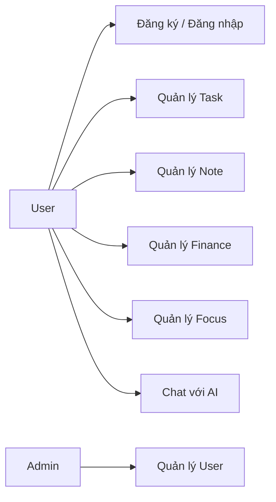

# Luồng nghiệp vụ chính theo kịch bản

## Mục tiêu của tài liệu này
Tài liệu này chuyển hệ thống Taskify sang dạng các kịch bản end-to-end để người đọc dễ hình dung cách hệ thống hoạt động trong thực tế sử dụng.

## Tại sao phần này quan trọng
Khi viết Word, chương phân tích thiết kế thường cần các use case rõ ràng. File này đóng vai trò cầu nối giữa kiến trúc kỹ thuật và hành vi nghiệp vụ thực tế.

## Sơ đồ use case tổng quát

## Kịch bản 1. Đăng ký và đăng nhập
### Tác nhân
`User`

### Tiền điều kiện
Người dùng chưa có phiên đăng nhập hợp lệ.

### Bước xử lý
1. Người dùng nhập email và password.
2. Frontend gọi `AuthController`.
3. Backend kiểm tra hợp lệ và tạo hoặc xác thực tài khoản.
4. Backend trả JWT và thông tin user.
5. Frontend lưu token và chuyển vào dashboard.

### Dữ liệu sinh ra
- `ApplicationUser`
- JWT token phía client

### Kết quả cuối
Người dùng có quyền truy cập hệ thống.

### Trường hợp lỗi
- Email đã tồn tại khi đăng ký.
- Password sai khi đăng nhập.
- Tài khoản bị khóa/banned.

## Kịch bản 2. Tạo task bằng giao diện
### Tác nhân
`User`

### Tiền điều kiện
Đã đăng nhập.

### Bước xử lý
1. Người dùng mở dialog tạo task.
2. Nhập tiêu đề, mô tả, ưu tiên, trạng thái, hạn xử lý, nhãn.
3. Frontend gọi `TaskItemController.Create`.
4. Backend gắn `UserId`, validate label và lưu `TaskItem`.
5. Frontend cập nhật danh sách task.

### Dữ liệu sinh ra
- `TaskItem`
- Quan hệ `TaskItem` với `Label`

### Kết quả cuối
Task xuất hiện ở dashboard/list/calendar/table.

### Trường hợp lỗi
- Label không hợp lệ hoặc không thuộc user.
- Dữ liệu đầu vào thiếu hoặc sai format.

## Kịch bản 3. Sửa hoặc xóa task
### Tác nhân
`User`

### Tiền điều kiện
Task đã tồn tại và thuộc user.

### Bước xử lý
1. Người dùng mở chi tiết task hoặc thao tác trực tiếp.
2. Frontend gọi update hoặc delete API.
3. Backend kiểm tra owner.
4. Task được cập nhật hoặc soft delete.
5. UI refresh danh sách.

### Dữ liệu sinh ra
- Dữ liệu `TaskItem` mới hoặc cờ `IsDeleted`.

### Kết quả cuối
Task phản ánh đúng trạng thái mới.

### Trường hợp lỗi
- Task không tồn tại.
- User không có quyền thao tác.

## Kịch bản 4. Xem task theo nhiều view
### Tác nhân
`User`

### Tiền điều kiện
Đã có dữ liệu task.

### Bước xử lý
1. Người dùng chuyển qua dashboard, list, calendar hoặc table.
2. Frontend dùng cùng nguồn dữ liệu task nhưng render theo bố cục khác nhau.
3. Người dùng lọc theo trạng thái, ưu tiên, hạn xử lý hoặc từ khóa.

### Dữ liệu sinh ra
- Không tạo entity mới.
- Sinh ra trạng thái hiển thị và filter cục bộ.

### Kết quả cuối
Người dùng xem cùng dữ liệu task ở nhiều góc nhìn.

### Trường hợp lỗi
- API filter lỗi hoặc dữ liệu chưa đồng bộ.

## Kịch bản 5. Tạo và quản lý note
### Tác nhân
`User`

### Tiền điều kiện
Đã đăng nhập.

### Bước xử lý
1. Người dùng mở note editor.
2. Tạo hoặc sửa tiêu đề, nội dung, trạng thái ghim.
3. Frontend gọi `NotesController`.
4. Backend lưu `Note`.
5. Frontend hiển thị danh sách note mới.

### Dữ liệu sinh ra
- `Note`

### Kết quả cuối
Người dùng có kho ghi chú cá nhân.

### Trường hợp lỗi
- Note không thuộc owner.
- Lỗi lưu nội dung.

## Kịch bản 6. Thêm khoản chi tiêu
### Tác nhân
`User`

### Tiền điều kiện
Đã có hoặc chọn được `FinanceCategory`.

### Bước xử lý
1. Người dùng mở finance dialog.
2. Nhập ngày, category, mô tả, amount.
3. Frontend gọi `FinanceEntriesController.Create`.
4. Backend validate category và amount.
5. Backend lưu `FinanceEntry`.
6. Frontend refresh bảng và summary.

### Dữ liệu sinh ra
- `FinanceEntry`

### Kết quả cuối
Khoản chi được phản ánh trong bảng và thống kê.

### Trường hợp lỗi
- Category không tồn tại.
- Amount không hợp lệ.

## Kịch bản 7. Bắt đầu và kết thúc focus session
### Tác nhân
`User`

### Tiền điều kiện
Đã đăng nhập.

### Bước xử lý
1. User chọn thời lượng focus.
2. Frontend gọi `FocusSessionController.Start`.
3. Khi kết thúc, frontend gọi API `End`.
4. Backend lưu thời gian bắt đầu, kết thúc, số break, trạng thái hoàn thành.
5. Frontend cập nhật thống kê ngày/tuần.

### Dữ liệu sinh ra
- `FocusSession`

### Kết quả cuối
Hệ thống có dữ liệu tập trung phục vụ thống kê.

### Trường hợp lỗi
- Session không thuộc owner.
- Dữ liệu kết thúc session không hợp lệ.

## Kịch bản 8. Admin quản lý user
### Tác nhân
`Admin`

### Tiền điều kiện
Tài khoản có role `Admin`.

### Bước xử lý
1. Admin vào trang `admin/users`.
2. Xem danh sách user, filter theo role/status.
3. Tạo user mới hoặc sửa user.
4. Backend dùng `AdminUsersController` để kiểm tra nghiệp vụ admin.

### Dữ liệu sinh ra
- `ApplicationUser` mới hoặc cập nhật role/trạng thái.

### Kết quả cuối
Admin kiểm soát được vòng đời tài khoản.

### Trường hợp lỗi
- Không đủ quyền.
- Trùng email.
- Cố thay đổi admin cuối cùng đang hoạt động.

## Kịch bản 9. Chat tạo task
### Tác nhân
`User`

### Tiền điều kiện
Đã đăng nhập, chat service đang hoạt động.

### Bước xử lý
1. User nhập câu như “Tạo task nộp báo cáo ngày mai”.
2. Frontend gửi sang `ChatController`.
3. Backend lưu message rồi gửi sang Rasa.
4. Rasa xác định intent `create_task`.
5. Action server gọi `api/internal/tasks/{userId}`.
6. Backend tạo `TaskItem`.
7. Assistant trả lại phản hồi xác nhận.

### Dữ liệu sinh ra
- `ChatSession`, `ChatMessage`
- `TaskItem`

### Kết quả cuối
Task được tạo qua ngôn ngữ tự nhiên.

### Trường hợp lỗi
- Rasa không hiểu intent.
- Internal API bị từ chối do token sai.

## Kịch bản 10. Chat tìm task
### Tác nhân
`User`

### Tiền điều kiện
Đã có task.

### Bước xử lý
1. User yêu cầu tìm hoặc liệt kê task.
2. Rasa xác định intent tìm kiếm/liệt kê.
3. Action server gọi internal task API với điều kiện phù hợp.
4. Assistant tổng hợp và trả về danh sách.

### Dữ liệu sinh ra
- Không tạo entity mới.
- Sinh danh sách trả lời theo filter.

### Kết quả cuối
Người dùng nhận được task đúng ngữ cảnh.

### Trường hợp lỗi
- Không có task khớp.
- Query mơ hồ.

## Kịch bản 11. Chat xóa task và undo
### Tác nhân
`User`

### Tiền điều kiện
Task tồn tại.

### Bước xử lý
1. User yêu cầu xóa task qua chat.
2. Nếu cần, hệ thống hỏi xác nhận hoặc chọn task phù hợp.
3. Action server gọi internal delete endpoint.
4. Backend soft delete task và tạo `TaskDeleteUndoToken`.
5. Assistant trả metadata để frontend hiện toast hoàn tác.
6. Nếu user chọn undo, backend khôi phục task.

### Dữ liệu sinh ra
- `DeletedAt`, `IsDeleted`
- `TaskDeleteUndoToken`

### Kết quả cuối
Task bị xóa nhưng có thể khôi phục trong thời gian hợp lệ.

### Trường hợp lỗi
- Không tìm thấy task khớp.
- Token undo hết hạn.

## Kịch bản 12. Chat ghi chú hoặc tài chính
### Tác nhân
`User`

### Tiền điều kiện
AI chat đang sẵn sàng.

### Bước xử lý
1. User yêu cầu tạo note hoặc thêm khoản chi.
2. Rasa phân loại intent tương ứng.
3. Action server gọi `api/internal/notes` hoặc `api/internal/finance`.
4. Backend tạo dữ liệu thật.
5. Frontend refresh note/finance sau khi chat trả về.

### Dữ liệu sinh ra
- `Note` hoặc `FinanceEntry`

### Kết quả cuối
Chat trở thành giao diện nhập liệu tự nhiên cho nhiều module.

### Trường hợp lỗi
- Dữ liệu thiếu.
- Giá trị amount không hợp lệ.

## Kịch bản 13. Fallback qua Gemini hoặc Ollama
### Tác nhân
`User`

### Tiền điều kiện
Đã cấu hình provider fallback hợp lệ.

### Bước xử lý
1. User gửi yêu cầu mà Rasa cần hỗ trợ ngữ cảnh hoặc fallback.
2. Backend tra `UserAiFallbackSettings`.
3. Hệ thống gọi Gemini hoặc Ollama.
4. Kết quả được dùng để chuẩn hóa context hoặc sinh reply fallback.

### Dữ liệu sinh ra
- Không nhất thiết tạo entity nghiệp vụ mới.
- Có thể cập nhật trạng thái validate/provider.

### Kết quả cuối
Chat có độ linh hoạt cao hơn ngoài rule/action cố định.

### Trường hợp lỗi
- API key Gemini sai.
- Ollama base URL hoặc model không hợp lệ.

## Liên hệ file khác
- Để hiểu tầng API đứng sau các kịch bản này, đọc [`05_backend_api_xac_thuc_va_nghiep_vu.md`](C:\Users\HP PC\source\repos\Taskify\phan_tich_do_an\05_backend_api_xac_thuc_va_nghiep_vu.md).
- Để hiểu luồng AI ở mức kỹ thuật sâu hơn, đọc [`06_he_thong_ai_chat_rasa_va_internal_api.md`](C:\Users\HP PC\source\repos\Taskify\phan_tich_do_an\06_he_thong_ai_chat_rasa_va_internal_api.md).
