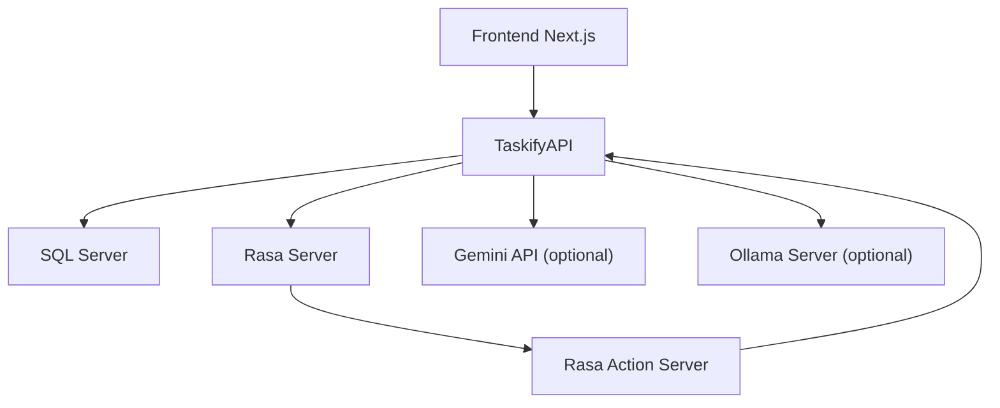

# Ràng buộc kỹ thuật, cấu hình và triển khai Taskify

## Mục tiêu của tài liệu này
Tài liệu này mô tả các điều kiện kỹ thuật để Taskify vận hành, các cấu hình quan trọng, sự phụ thuộc giữa các service và các rủi ro kỹ thuật hiện tại.

## Tại sao phần này quan trọng
Một tài liệu hệ thống đầy đủ không chỉ mô tả chức năng mà còn phải cho thấy hệ thống cần môi trường gì để chạy, có ràng buộc nào và các điểm nào cần cải tiến khi triển khai thực tế.

## Các dependency vận hành chính
| Thành phần | Công nghệ | Vai trò |
| --- | --- | --- |
| Frontend | Node.js, Next.js | Chạy giao diện web |
| Backend | .NET 8 SDK, ASP.NET Core | Chạy API chính |
| Database | SQL Server | Lưu toàn bộ dữ liệu hệ thống |
| AI Chat | Python 3.8-3.11, Rasa | Xử lý NLU và dialogue |
| Action Server | Python, rasa-sdk | Chạy custom actions |
| AI Fallback | Gemini API hoặc Ollama | Mở rộng khả năng AI |

## Các cấu hình quan trọng
| Cấu hình | Ý nghĩa |
| --- | --- |
| `ConnectionStrings:DefaultConnection` | Kết nối SQL Server |
| `JwtSettings:SecretKey` | Khóa ký JWT |
| `JwtSettings:Issuer` | Nguồn phát hành token |
| `JwtSettings:Audience` | Đối tượng nhận token |
| `JwtSettings:ExpirationMinutes` | Thời gian sống của token |
| `Rasa:BaseUrl` | Địa chỉ Rasa server |
| `Rasa:Token` | Token tùy chọn khi gọi Rasa |
| `Rasa:ApiKey` | Khóa cho `internal API` |
| `Gemini:Model` | Model Gemini mặc định |
| `Gemini:TimeoutSeconds` | Timeout gọi Gemini |
| `Ollama:TimeoutSeconds` | Timeout gọi Ollama |

## Sự phụ thuộc khi chạy local

## Trình tự chạy điển hình
1. Khởi động SQL Server và bảo đảm connection string đúng.
2. Chạy `TaskifyAPI`.
3. Chạy Rasa server.
4. Chạy Rasa action server.
5. Chạy frontend Next.js.
6. Nếu dùng AI fallback, cấu hình Gemini hoặc Ollama từ phần settings.

## Ràng buộc kỹ thuật nổi bật
### 1. Phụ thuộc đa tiến trình
Taskify không chỉ là một app web đơn. Để AI chat hoạt động đầy đủ cần ít nhất frontend, backend, database, Rasa server và action server cùng hoạt động.

### 2. Cấu hình thiên về development
Một số cấu hình như secret trong file config, localhost URLs, hoặc `RequireHttpsMetadata = false` cho JWT đang phù hợp môi trường phát triển hơn là production.

### 3. Giao tiếp nhiều lớp
Luồng chat phải đi qua nhiều lớp nối tiếp, làm tăng độ trễ và độ phức tạp khi debug.

### 4. Phụ thuộc chất lượng tiếng Việt
Phần NLU, entity extraction và phản hồi tiếng Việt phụ thuộc dữ liệu huấn luyện và custom components như PhoBERT/VnCoreNLP trong thư mục `rasa`.

## Rủi ro kỹ thuật hiện tại
| Rủi ro | Ảnh hưởng |
| --- | --- |
| Secret nằm trong config dev | Không an toàn khi đưa thẳng ra production |
| Local-only URLs | Khó triển khai phân tán nếu không chuẩn hóa môi trường |
| Service coupling giữa backend và Rasa | Một mắt xích hỏng sẽ làm chat suy giảm |
| Timeout AI/Rasa | Ảnh hưởng trực tiếp tới trải nghiệm người dùng |
| Encoding tiếng Việt | Có thể gây khó đọc log hoặc sai lệch dữ liệu huấn luyện |
| Debug đa tầng | Tốn công theo dõi log ở nhiều tiến trình |

## Hướng cải tiến đề xuất
1. Chuyển secret và API key sang secret manager hoặc biến môi trường.
2. Tách rõ cấu hình `Development`, `Staging`, `Production`.
3. Bổ sung cơ chế quan sát log xuyên suốt cho chat flow.
4. Tăng test coverage cho internal API và custom actions.
5. Chuẩn hóa chiến lược retry và timeout cho Rasa, Gemini, Ollama.
6. Xem xét hàng đợi hoặc event-driven approach nếu chat flow mở rộng lớn hơn.

## Dữ liệu vào/ra
- Đầu vào: file cấu hình, service endpoints, môi trường runtime, khóa bảo mật.
- Đầu ra: hệ thống chạy ổn định hoặc lỗi runtime tùy mức đầy đủ của các dependency.

## Thành phần liên quan
- `TaskifyAPI/appsettings.json`
- `TaskifyAPI/Program.cs`
- `rasa/endpoints.yml`, `rasa/config.yml`
- `run-all.bat`

## Tình huống lỗi triển khai thường gặp
- Backend chạy nhưng frontend không gọi được do sai CORS hoặc sai base URL.
- Chat controller hoạt động nhưng Rasa không chạy nên chỉ trả fallback message.
- Action server không chạy nên Rasa hiểu intent nhưng không thao tác được dữ liệu thật.
- Provider Ollama/Gemini được chọn nhưng cấu hình không hợp lệ.

## Liên hệ file khác
- Để hiểu toàn bộ kiến trúc phụ thuộc lẫn nhau ra sao, đọc [`02_kien_truc_tong_the_va_thanh_phan.md`](C:\Users\HP PC\source\repos\Taskify\phan_tich_do_an\02_kien_truc_tong_the_va_thanh_phan.md).
- Để hiểu các lỗi kỹ thuật này tác động trực tiếp lên chat như thế nào, đọc [`06_he_thong_ai_chat_rasa_va_internal_api.md`](C:\Users\HP PC\source\repos\Taskify\phan_tich_do_an\06_he_thong_ai_chat_rasa_va_internal_api.md).
